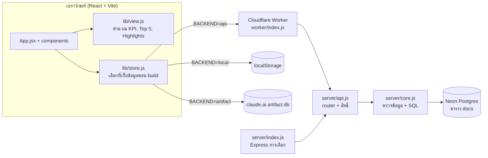
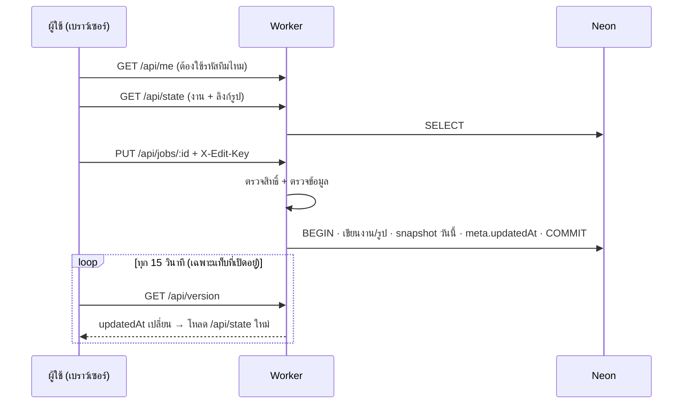
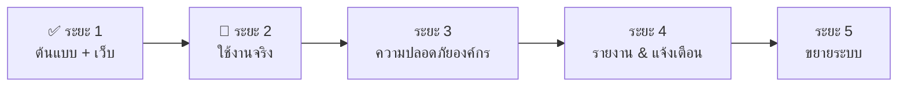

# P1 Maintenance Dashboard — เอกสารระบบ บันทึกการทำงาน และ Roadmap

> อัปเดตล่าสุด: 30 ก.ย. 2569 · Repo: `piyamonw0423-glitch/P1-CRITICAL-TOP5-MAINTENANCE-PP561011-` (branch `main`)

## 1. ภาพรวม

แดชบอร์ดติดตามงานซ่อมเร่งด่วน **Priority 1 (Top 5)** ของโรงไฟฟ้า **5, 10, 6, 11** ให้ผู้บริหารและทีมเห็นภาพรวมในหน้าเดียว
และให้ทีมอัปเดตงานรายวัน (ความคืบหน้า สถานะ ปัญหาที่ติด รูปหน้างาน เลข WO) ได้เอง

| ช่องทาง | ลิงก์ | การเก็บข้อมูล | ใช้เมื่อ |
|---|---|---|---|
| **Cloudflare (หลัก)** | https://p1-critical-top5-maintenance-pp561011.piyamon-w0423.workers.dev/ | ฐานข้อมูลกลาง Neon Postgres ทุกคนเห็นชุดเดียวกัน | ใช้งานจริงของทีม |
| GitHub Pages | https://piyamonw0423-glitch.github.io/P1-CRITICAL-TOP5-MAINTENANCE-PP561011-/ | ในเบราว์เซอร์แต่ละเครื่อง (localStorage) | สาธิต / ใช้คนเดียว |
| claude.ai Artifact | https://claude.ai/artifact/Q361xADA9LoeKthAoTfEA7 | ฐานข้อมูลของ Artifact (ต้องมีบัญชี claude.ai) | ต้นแบบระยะแรก |

ต้นฉบับงานออกแบบ: `project/P1 Repair Dashboard v2.dc.html` (Claude Design) และบทสนทนาใน `chats/chat1.md`

## 2. สถาปัตยกรรม



โค้ดหน้าเว็บชุดเดียว build ได้ 3 แบบ โดยค่าคงที่ `__BACKEND__` ตอน build:

| คำสั่ง | `__BACKEND__` | ผลลัพธ์ | ใช้กับ |
|---|---|---|---|
| `npm run build` | `local` | `dist/` เก็บข้อมูลใน localStorage | GitHub Pages |
| `npm run build:server` | `api` | `dist/` เรียก `/api/*` | Cloudflare Worker / Node server |
| `npm run build:artifact` | `artifact` | `dist-artifact/p1-dashboard.html` ไฟล์เดียว | claude.ai Artifact |

## 3. โครงสร้างไฟล์

```
src/
  main.jsx, App.jsx          จุดเริ่มและหน้าหลัก (state, บันทึก, นำเข้า/ส่งออก, dialog)
  components/
    Header.jsx               แถบหัว + แถบโหมดแก้ไข (ปุ่ม Excel/สำรอง/นำเข้า)
    Summary.jsx              ตัวกรองเลือกดู, กล่อง KPI, Key Highlights
    PlantCard.jsx            การ์ดรายโรง: วงกลม %, ผลกระทบ, รายการงาน Top 5/ทั้งหมด
    Insights.jsx             สรุป Blocker + กราฟแนวโน้ม
    Modals.jsx               ฟอร์มแก้งาน, ฟอร์มผลกระทบ, ดูรูปใหญ่
    ExcelImport.jsx          หน้าตรวจก่อนนำเข้า Excel
    Feedback.jsx             กล่องยืนยัน, แจ้งเตือน (toast), ช่องรหัสผ่านทีม
    States.jsx               หน้ากำลังโหลด / ว่าง / เชื่อมต่อไม่ได้
  lib/
    data.js                  สีประจำโรง/สถานะ/ปัญหา, ข้อมูลตัวอย่าง (SEED), กติกา bucket
    view.js                  คำนวณทุกอย่างที่แสดงผล
    store.js                 ที่เก็บข้อมูล 3 แบบ (local / artifact / api)
    excel.js                 สร้าง/อ่านไฟล์ .xlsx และวางแผนการนำเข้า
    dates.js, photos.js, icons.jsx, jsx-shim.js
server/
  core.js                    ตรวจความถูกต้อง + อ่าน/เขียน Postgres (ใช้ร่วม Worker/Node)
  api.js                     router /api/* + สิทธิ์ (รหัสทีม, Access, editor list)
  index.js                   เซิร์ฟเวอร์ Node/Express (สำรองไว้รันในองค์กร)
worker/index.js              Cloudflare Worker: เสิร์ฟหน้าเว็บ + API, ต่อ Neon
wrangler.jsonc               ตั้งค่า Worker (ชื่อ, build ก่อน deploy, workers.dev)
.github/workflows/deploy.yml build แล้วเผยแพร่ GitHub Pages (branch gh-pages)
scripts/build-artifact.mjs   รวมเป็นไฟล์เดียวสำหรับ Artifact
project/, chats/, HANDOFF.md ต้นฉบับงานออกแบบจาก Claude Design
```

## 4. Logic การคำนวณ (src/lib/data.js, src/lib/view.js)

**สถานะของงาน (bucket)** ใช้กับ KPI, วงกลม %, กราฟ
- `done` เสร็จแล้ว: สถานะ = เสร็จแล้ว
- `stuck` ค้าง/เกินกำหนด: สถานะ = ยังไม่เริ่ม **หรือ** เลยวันกำหนดเสร็จแล้วแต่ยังไม่เสร็จ
- `doing` กำลังทำ: นอกเหนือจากนั้น

**ตัวเลข**
- % สำเร็จของโรง = งานเสร็จ ÷ งานทั้งหมดของโรง
- KPI ด้านบนคำนวณเฉพาะโรงที่เลือกในตัวกรอง (ทั้งหมด / กลุ่ม 5+10, 6+11 / รายโรง)
- วันที่ "วันนี้" ใช้เวลาไทย (UTC+7) ทั้งหน้าเว็บและเซิร์ฟเวอร์

**Top 5 ต่อโรง**: เรียงงานที่ยังไม่เสร็จขึ้นก่อน แล้วตามลำดับความสำคัญ (rank) แสดง 5 งานแรก
- โหมดดู: ปุ่ม "+ ดูอีก N งาน" · โหมดแก้ไข: แสดงทุกงาน มีเส้นแบ่ง "งานอื่นๆ นอก Top 5"
- ป้าย "เกินกำหนด" สีแดงเมื่อเลยวันกำหนดเสร็จ · ข้อความ "เหลือ N วัน / เกิน N วัน"

**Key Highlights (สรุปอัตโนมัติ)**: ยอดรวม+%, โรงที่ค้างมากสุด 2 โรง, ปัญหาที่ติดมากสุด 3 อันดับ, งานเกินกำหนดที่นานที่สุด

**กราฟแนวโน้ม**: ทุกครั้งที่บันทึก ระบบเก็บ snapshot ของวันนั้น (1 จุดต่อวัน แยกรายโรง) แสดงย้อนหลัง 8 จุด

**ฟอร์มแก้งาน**: ลากความคืบหน้าถึง 100% → สถานะเป็น "เสร็จแล้ว" อัตโนมัติ, เลือก "เสร็จแล้ว" → ความคืบหน้า 100%,
รูปงานละไม่เกิน 4 รูป ย่อเหลือด้านยาว 720px (บีบอัดเพิ่มถ้าไฟล์ใหญ่)

## 5. โครงสร้างข้อมูล

**งาน (job)**: `id, wo, plant(5|10|6|11), rank, issue, action, owner, team, start, end (YYYY-MM-DD), progress(0–100), status(pending|doing|done), blocker(none|part|permit|manpower|shutdown|vendor|budget), note, photos[]`

**Postgres (Neon)** ใช้ตารางเดียว:

```sql
CREATE TABLE docs (collection text, id text, data jsonb, updated_at timestamptz, PRIMARY KEY (collection, id));
```

| collection | id | data |
|---|---|---|
| `jobs` | รหัสงาน | งาน (ไม่รวมรูป) |
| `photos` | รหัสรูป | `{ jobId, src (data:image/jpeg;base64…), date }` |
| `plants` | 5/10/6/11 | `{ impact: [ข้อความ] }` |
| `history` | YYYY-MM-DD | `{ date, done, doing, stuck, p: {รายโรง} }` |
| `meta` | `app` | `{ updatedAt, updatedBy }` · `seeded` = ใส่ข้อมูลตัวอย่างแล้ว |

ครั้งแรกที่ Worker ต่อฐานข้อมูลได้ จะสร้างตารางและใส่ข้อมูลตัวอย่าง 26 งาน (ครั้งเดียว)

## 6. การบันทึกและการซิงก์ (Cloudflare)



- รูปไม่ส่งมากับข้อมูลหลัก โหลดแยกที่ `/api/photos/:id` และเบราว์เซอร์จำไว้ (ประหยัด CPU ของ Worker ฟรี)
- เชื่อมต่อ Neon: ลอง WebSocket (`@neondatabase/serverless`) ก่อน ไม่ได้จึงใช้ TCP (`pg`)
- ตั้งเวลายอมแพ้: เชื่อมต่อ 10 วิ, คำสั่ง 20 วิ, หน้าเว็บรอ 30 วิ แล้วแสดง "รหัสปัญหา"

**API**

| Method | Path | ใช้ทำ |
|---|---|---|
| GET | `/api/health` | ตรวจการเชื่อมต่อฐานข้อมูล (แสดงสาเหตุถ้าไม่ได้) |
| GET | `/api/me` | อีเมลผู้ใช้ (ถ้าเปิด Access), แก้ไขได้ไหม, ต้องใช้รหัสทีมไหม |
| GET | `/api/state` · `/api/version` | ข้อมูลทั้งหมด · เวลาอัปเดตล่าสุด |
| GET | `/api/photos/:id` | ไฟล์รูป |
| POST | `/api/check-key` | ตรวจรหัสทีม |
| PUT/DELETE | `/api/jobs/:id` | บันทึก/ลบงาน |
| PUT | `/api/plants/:id` | บันทึกผลกระทบ |
| POST | `/api/import` | นำเข้าหลายงาน (`replace: true` = แทนที่ทั้งหมด) |

## 7. ความปลอดภัย

| ชั้น | ตั้งค่าที่ | ผล |
|---|---|---|
| รหัสผ่านทีม | Secret `EDIT_PASSWORD` | ดูได้ทุกคน แก้ไขต้องใส่รหัส (จำไว้ในเครื่อง, เทียบแบบ constant-time) |
| ล็อกอินอีเมลบริษัท | Cloudflare Access + `ACCESS_TEAM_DOMAIN`, `ACCESS_AUD` | Worker ตรวจ JWT ของ Access ทุกครั้ง, บันทึกอีเมลผู้แก้ล่าสุด |
| รายชื่อผู้แก้ไข | `EDITOR_EMAILS` (ใช้คู่ Access) | คนนอกรายชื่อดูได้อย่างเดียว |
| ตรวจข้อมูล | server/core.js | รหัส, โรง, วันที่, สถานะ, ขนาด/ชนิดรูป ถูกตรวจก่อนบันทึก |
| ความลับ | Cloudflare Secrets | `DATABASE_URL` ไม่อยู่ในโค้ด/หน้าเว็บ, ข้อความ error ตัดลิงก์ฐานข้อมูลออก |
| อื่นๆ | wrangler.jsonc | ปิด preview URLs, HTTPS ทุกช่องทาง |

ข้อมูลมีชื่อพนักงาน (ข้อมูลส่วนบุคคลตาม PDPA) ควรแจ้งฝ่าย IT/ผู้ดูแลนโยบายข้อมูลก่อนใช้งานจริง

## 8. นำเข้า/ส่งออก Excel (src/lib/excel.js)

- **ส่งออก Excel**: ไฟล์ .xlsx 3 ชีต — `งาน P1` (13 คอลัมน์), `ผลกระทบ`, `วิธีใช้` ใช้เป็นแม่แบบได้ทันที
- **นำเข้า Excel**: อ่านในเบราว์เซอร์ → ตรวจทุกแถว (แจ้งเลขแถว+สาเหตุ แถวผิดถูกข้าม) → หน้าตรวจก่อนยืนยัน
  - จับคู่งานเดิมด้วย **เลข WO** (ถ้าไม่มี ใช้ โรง+ปัญหาเครื่องจักร)
  - โหมด **อัปเดตและเพิ่ม** / **แทนที่ทั้งหมด** (ลบงานที่ไม่มีในไฟล์)
  - รูปหน้างานเดิมไม่หาย · วันที่ ค.ศ./พ.ศ./ช่องวันที่ Excel · % หรือ 0–100 · สถานะว่าง = คำนวณจากความคืบหน้า
- **สำรองข้อมูล (.json)**: รวมรูปทั้งหมด ใช้กู้คืนผ่านปุ่มนำเข้าเดียวกัน

## 9. การ Deploy และการตั้งค่า

**Cloudflare Worker** (`p1-critical-top5-maintenance-pp561011`)
- เชื่อม GitHub แล้ว: push เข้า `main` → Workers Builds → deploy อัตโนมัติ
- `wrangler.jsonc` สั่ง `npm run build:server` ก่อน deploy เสมอ (กันการได้เวอร์ชัน localStorage)
- `keep_vars: true` ค่าที่ตั้งใน dashboard ไม่หายตอน deploy
- Settings → Variables and Secrets: `DATABASE_URL` (Secret, ลิงก์ Neon แบบ pooled), `EDIT_PASSWORD` (Secret)

**Neon**: โปรเจกต์ฟรี 0.5 GB, region Singapore, ใช้ connection string แบบ Connection pooling (มี `-pooler`)

**GitHub Pages**: workflow `.github/workflows/deploy.yml` build แบบ local แล้ว push ไป branch `gh-pages`

**ทดสอบในเครื่อง**
```bash
npm install
npm run dev                         # หน้าเว็บแบบ localStorage
echo 'DATABASE_URL=postgres://...' > .dev.vars
npm run dev:worker                  # Worker + ฐานข้อมูลจริง (http://localhost:8787)
```

## 10. แก้ปัญหาที่พบบ่อย (ดู "รหัสปัญหา" บนหน้าเว็บ หรือเปิด `/api/health`)

| อาการ / รหัสปัญหา | สาเหตุ | วิธีแก้ |
|---|---|---|
| `DATABASE_URL is not set` | ยังไม่ได้ตั้งค่า หรือยังไม่ Deploy | เพิ่ม Secret `DATABASE_URL` แล้วกด Deploy |
| `connect: … timed out` / `password authentication failed` / `ENOTFOUND` | ลิงก์ Neon ผิด/ไม่ครบ/รหัสเป็น `****` | คัดลอกใหม่จาก Neon (เปิด pooling, แสดงรหัสผ่าน) |
| โหลดนานครั้งแรก 5–20 วิ | Neon พักเครื่องเมื่อไม่มีคนใช้ | ปกติ รอสักครู่ |
| อัปเดตแล้วเครื่องอื่นไม่เห็น | ได้เวอร์ชัน localStorage | แก้แล้วใน wrangler.jsonc (build:server ก่อน deploy) |
| งานหายหลังบันทึก | งานเสร็จ/ลำดับเกิน 5 จึงไม่อยู่ใน Top 5 | กด "ดูอีก N งาน" หรือเข้าโหมดแก้ไข |
| "รหัสผ่านทีมไม่ถูกต้อง" | ใส่ผิดหรือเปลี่ยนรหัสแล้ว | ใส่รหัสใหม่ในช่องที่ขึ้นมา |
| "No URLs enabled" ใน Cloudflare | ยังไม่เปิด workers.dev | Settings → Domains & Routes → workers.dev → Enable |

## 11. บันทึกการทำงาน (30 ก.ย. 2569)

| เวลา | Commit | สิ่งที่ทำ |
|---|---|---|
| 04:07 | `e8b5fa0` | รับงานออกแบบจาก Claude Design (P1 Repair Dashboard v2) |
| 04:12 | `3fd2abc` | สร้างเว็บ React + Vite ตามแบบ: KPI, Highlights, การ์ด 4 โรง, ตัวกรอง, Blocker, กราฟ, โหมดแก้ไข, รูป |
| 04:44 | `67fa8d7` | ปรับให้ทำงานใน claude.ai Artifact (กล่องยืนยันในหน้า, ส่งออกไฟล์) |
| 04:52 | `b957f43` | ข้อมูลกลางบน Artifact db ทุกคนเห็นชุดเดียวกัน |
| 06:45 | `d9699a2` | เพิ่มเลข WO, คืนหน้าตาตามรูป (หัวเรื่อง P1 CRITICAL) |
| 06:58 | `25bbafd` | เปิดเว็บบน GitHub Pages (deploy ผ่าน branch gh-pages) |
| 07:11 | `fdf11db` | เซิร์ฟเวอร์ Node + Postgres (แผน Render + Supabase) |
| 07:38 | `14f8acf` | ย้ายเป็น Cloudflare Workers + Neon, รหัสผ่านทีม, Cloudflare Access |
| 08:28–08:29 | `9137f0c`, `0c072ff` | เปิด workers.dev, ตั้งชื่อ Worker ให้ตรง dashboard |
| 08:38 | `105c6de` | รูปโหลดแยก, แสดงสาเหตุเมื่อเชื่อมต่อไม่ได้, แก้ช่องรหัสผ่านไม่ขึ้น |
| 09:18 | `bc0c28a` | แก้ "อัปเดตแล้วไม่ขึ้น" (บังคับ build:server), แสดงทุกงาน/ดูอีก N งาน, ไฮไลต์งานที่บันทึก |
| 09:20 | `643231a` | เก็บค่าตัวแปรใน dashboard ไม่ให้หายตอน deploy |
| 09:39 | `5fab30c` | แก้โหลดค้าง: ตั้งเวลายอมแพ้, ใช้ Neon WebSocket driver, บอกสาเหตุชัดเจน |
| 09:49 | `caf22fb` | นำเข้า/ส่งออก Excel |

## 12. Roadmap



**✅ ระยะ 1 — ต้นแบบและเว็บ (เสร็จแล้ว)**
แดชบอร์ดหน้าเดียวตามแบบ, โหมดอัปเดตรายวัน, รูปหน้างาน, เลข WO, ตัวกรอง, 3 ช่องทาง deploy, ฐานข้อมูลกลาง, รหัสทีม, Excel

**🔄 ระยะ 2 — เริ่มใช้งานจริง (ทำต่อทันที)**
1. ยืนยันว่า Worker ต่อ Neon ได้ (หน้าเว็บแสดง 26 งาน ไม่มีรหัสปัญหา)
2. ตั้ง `EDIT_PASSWORD` และแจ้งรหัสให้ทีม
3. ส่งออก Excel → ใส่งานจริง+เลข WO จริง → นำเข้าแบบ "แทนที่ทั้งหมด" เพื่อล้างข้อมูลตัวอย่าง
4. แจ้งลิงก์ Cloudflare ให้ผู้บริหาร/ทีม, กำหนดผู้รับผิดชอบอัปเดตรายวัน

**ระยะ 3 — ความปลอดภัยสำหรับองค์กร**
- เปิด Cloudflare Access จำกัดอีเมลบริษัท (ฟรี ≤ 50 คน) + `EDITOR_EMAILS` แยกคนดู/คนแก้
- ขออนุมัติ IT/PDPA, ตั้งโดเมนบริษัท (custom domain) แทน workers.dev
- สำรองข้อมูลอัตโนมัติรายวัน (Neon branch/restore หรือ cron export)

**ระยะ 4 — รายงานและแจ้งเตือน**
- ประวัติการแก้ไขรายงาน (ใครแก้อะไร เมื่อไหร่) และไทม์ไลน์ของแต่ละ WO
- แจ้งเตือนงานใกล้/เกินกำหนดทาง LINE หรืออีเมล
- สรุปรายสัปดาห์เป็น PDF/สไลด์สำหรับประชุมผู้บริหาร
- ย้ายรูปไปเก็บ Cloudflare R2 (10 GB ฟรี) เมื่อรูปเยอะ

**ระยะ 5 — ขยายระบบ**
- เชื่อมระบบ WO/CMMS ขององค์กร (เช่น SAP PM) เพื่อดึงงานอัตโนมัติ
- เพิ่มโรงไฟฟ้า/Priority อื่น, ติดตั้งเป็นแอปบนมือถือ (PWA) ใช้หน้างาน

## 13. สถานะล่าสุดและสิ่งที่ค้าง

- ✅ โค้ดล่าสุดอยู่บน GitHub `main`, Cloudflare และ GitHub Pages build ผ่าน
- ⏳ รอยืนยันว่าเว็บ Cloudflare ต่อ Neon สำเร็จ (ล่าสุดใส่ `DATABASE_URL` แล้ว กำลังตรวจ)
- ⏳ ข้อมูลในระบบยังเป็นข้อมูลตัวอย่าง รอแทนที่ด้วยข้อมูลจริงผ่าน Excel
- ℹ️ session ที่พัฒนาไม่สามารถเปิด `*.workers.dev` / `neon.tech` ได้ (นโยบายเครือข่าย) การตรวจเว็บจริงต้องอาศัยภาพหน้าจอจากผู้ใช้
