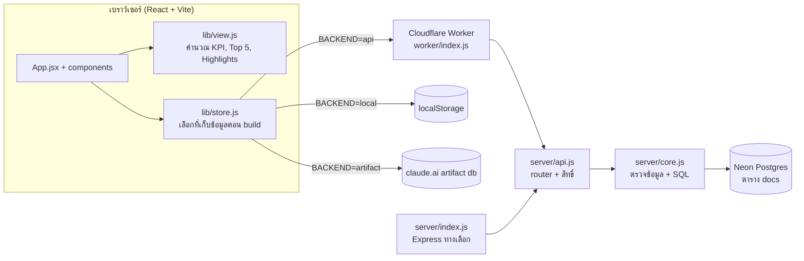
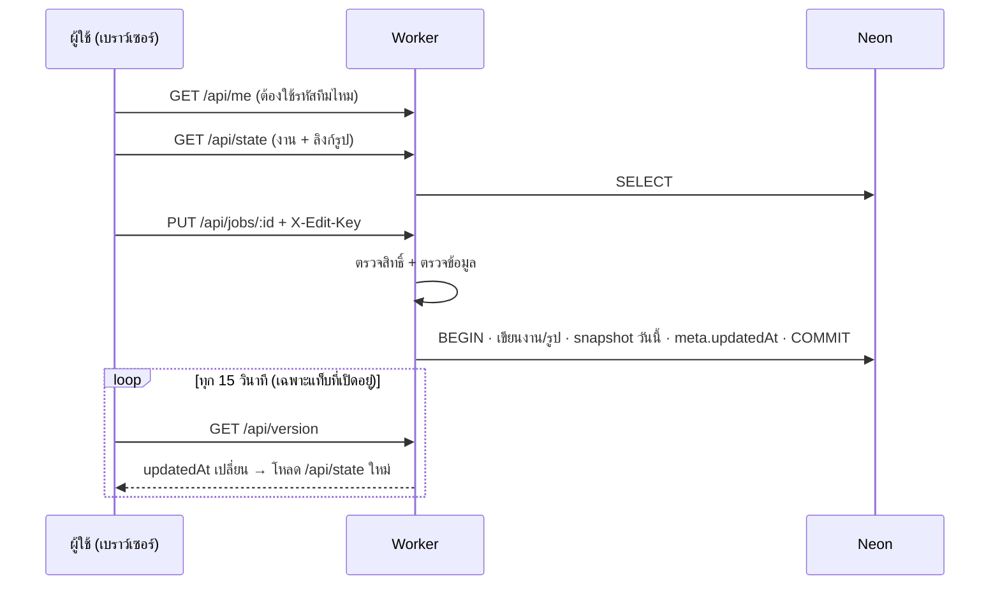
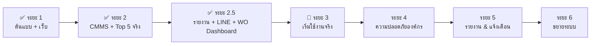

# TOP5 Maintenance Dashboard PP561011 — เอกสารระบบ บันทึกการทำงาน และ Roadmap

> อัปเดตล่าสุด: 5 ต.ค. 2569 (commit `70db4eb`) · Repo: `piyamonw0423-glitch/P1-CRITICAL-TOP5-MAINTENANCE-PP561011-` (branch `main`)

## 1. ภาพรวม

แดชบอร์ดติดตามงานซ่อมเร่งด่วน **Priority 1** ของโรงไฟฟ้า **5, 10, 6, 11** ให้ผู้บริหารและทีมเห็นภาพรวมในหน้าเดียว มี 2 ชั้นข้อมูล:

1. **WO Backlog จาก CMMS** — WO P1 ทั้งหมด (เช่น 349 WO) อัปโหลดจากไฟล์ export อัปเดตแบบ merge ตามเลข WO ใช้คำนวณกล่องตัวเลขด้านบน
2. **Top 5 ที่ทีมเลือกติดตาม** — แต่ละโรงมี 2 รายการ: **ความเสี่ยงเครื่องจักร (BD)** และ **งานประจำวัน** จัดอันดับเองได้ (▲▼ / ลากวาง)
   ทีมอัปเดตความคืบหน้า สถานะ ปัญหาที่ติด รูปหน้างาน เลข WO ได้เอง

มี 2 หน้า (แถบใต้หัวเว็บ): **Dashboard Top 5** (การ์ดรายโรง, รายงานประจำวัน, ผลงานสะสม, WO Backlog) และ **Dashboard WO Backlog P1** (สรุปงานค้างแบบรายสัปดาห์ของทีม, ลิงก์ `#wo-dashboard`)

| ช่องทาง | ลิงก์ | การเก็บข้อมูล | ใช้เมื่อ |
|---|---|---|---|
| **Cloudflare (หลัก)** | https://p1-critical-top5-maintenance-pp561011.piyamon-w0423.workers.dev/ | ฐานข้อมูลกลาง Neon Postgres ทุกคนเห็นชุดเดียวกัน | ใช้งานจริงของทีม |
| GitHub Pages | https://piyamonw0423-glitch.github.io/P1-CRITICAL-TOP5-MAINTENANCE-PP561011-/ | ในเบราว์เซอร์แต่ละเครื่อง (localStorage) | สาธิต / ใช้คนเดียว |
| claude.ai Artifact | https://claude.ai/artifact/Q361xADA9LoeKthAoTfEA7 | ฐานข้อมูลของ Artifact (ต้องมีบัญชี claude.ai) | ต้นแบบระยะแรก |

ต้นฉบับงานออกแบบ: `project/P1 Repair Dashboard v2.dc.html` (Claude Design) และบทสนทนาใน `chats/chat1.md`

## 2. สถาปัตยกรรม



โค้ดหน้าเว็บชุดเดียว build ได้ 3 แบบ โดยค่าคงที่ `__BACKEND__` ตอน build:

| คำสั่ง | `__BACKEND__` | ผลลัพธ์ | ใช้กับ |
|---|---|---|---|
| `npm run build` | `local` | `dist/` เก็บข้อมูลใน localStorage | GitHub Pages |
| `npm run build:server` | `api` | `dist/` เรียก `/api/*` | Cloudflare Worker / Node server |
| `npm run build:artifact` | `artifact` | `dist-artifact/p1-dashboard.html` ไฟล์เดียว | claude.ai Artifact |

## 3. โครงสร้างไฟล์

```
src/
  main.jsx, App.jsx          จุดเริ่มและหน้าหลัก (state, บันทึก, นำเข้า/ส่งออก, เลือกหลายงาน, dialog)
  components/
    Header.jsx               แถบหัว + แถบโหมดแก้ไข (Excel, อัปโหลด CMMS, สำรอง, ลบงานซ้ำ)
    Summary.jsx              ตัวกรองเลือกดู, กล่อง KPI (ปรับขนาดตามกล่อง), Key Highlights
    PlantCard.jsx            การ์ดรายโรง: วงกลม %, ผลกระทบ, แท็บ 2 รายการ, ▲▼/ลากวาง, ช่องติ๊ก
    Backlog.jsx              แผง WO Backlog จาก CMMS + หน้าตรวจก่อนอัปโหลด (merge)
    Duplicates.jsx           หน้าตรวจ "ลบงานซ้ำ" + แถบ % ระหว่างลบ
    Selection.jsx            แถบ "เลือกแล้ว N งาน" + หน้ายืนยันลบหลายงาน
    Report.jsx               รายงานประจำวัน CMMS: เปิดงาน (Actual Start)/แทรก/เริ่ม/เสร็จรอปิด/CLOSED/คงค้าง, สรุปรายโรง, แยก WL, รายการพับได้, คัดลอกรายงานรอบ
    HistoryReport.jsx        ผลงาน P1 สะสม (ฐานข้อมูลประวัติทั้งปี) + หน้านำเข้าฐานประวัติ
    BacklogDashboard.jsx     หน้า Dashboard WO Backlog P1 (หัว, KPI, ตาราง, โดนัท/แถบ, เป้าหมาย/Insight) + PageTabs
    WlSelect.jsx             ตัวกรอง WO_Worklocation เลือกได้หลายรหัส
    Insights.jsx             สรุป Blocker + กราฟแนวโน้ม
    Modals.jsx               ฟอร์มแก้งาน (รายการ/อันดับ/WO), ฟอร์มผลกระทบ, ดูรูปใหญ่
    ExcelImport.jsx          หน้าตรวจก่อนนำเข้า Excel
    Feedback.jsx             กล่องยืนยัน, แจ้งเตือน (toast), ช่องรหัสผ่านทีม (แสดงรหัสได้)
    States.jsx               หน้ากำลังโหลด / ว่าง / เชื่อมต่อไม่ได้
  lib/
    data.js                  ค่าคงที่ (TOP_N, MAX_JOBS_PER_PLANT, LISTS), สี, ข้อมูลตัวอย่าง, กติกา bucket
    view.js                  คำนวณทุกอย่างที่แสดงผล (KPI, 2 รายการต่อโรง, Highlights, กราฟ)
    store.js                 ที่เก็บข้อมูล 3 แบบ (local / artifact / api)
    cmms.js                  อ่านไฟล์ CMMS, กลุ่มสถานะ, ทีม (WO_Worklocation), merge รอบอัปโหลด, สถิติรายวัน, สร้างงานจาก WO
    dedupe.js                หางานซ้ำ (เลข WO / โรง+ชื่องาน) และเลือกงานที่เก็บไว้
    excel.js                 สร้าง/อ่านไฟล์ .xlsx, วางแผนการนำเข้า, ส่งออก WO Backlog ตามตัวกรอง
    roundReport.js           ข้อความรายงานรอบ 09:30/16:30 แยกรายโรง (ใช้ทั้ง LINE และปุ่มคัดลอก)
    backlogDash.js           คำนวณหน้า Dashboard WO Backlog (KPI, กลุ่มสถานะ, ทีม, Aging, โรง, Next Approve)
    dates.js, photos.js, icons.jsx, jsx-shim.js
server/
  core.js                    ตรวจความถูกต้อง + อ่าน/เขียน Postgres (ใช้ร่วม Worker/Node)
  api.js                     router /api/* + สิทธิ์ (รหัสทีม, Access, editor list)
  line.js                    LINE: ส่งสรุป, ตอบ "สรุป"/"id", ตรวจลายเซ็น webhook, เตือนเมื่อยังไม่อัปโหลด
  index.js                   เซิร์ฟเวอร์ Node/Express (สำรองไว้รันในองค์กร)
worker/index.js              Cloudflare Worker: เสิร์ฟหน้าเว็บ + API, ต่อ Neon
wrangler.jsonc               ตั้งค่า Worker (ชื่อ, build ก่อน deploy, workers.dev)
.github/workflows/deploy.yml build แล้วเผยแพร่ GitHub Pages (branch gh-pages)
scripts/build-artifact.mjs   รวมเป็นไฟล์เดียวสำหรับ Artifact
project/, chats/, HANDOFF.md ต้นฉบับงานออกแบบจาก Claude Design
```

## 4. Logic การคำนวณ (src/lib/data.js, src/lib/view.js)

**สถานะของงาน (bucket)** ใช้กับ KPI, วงกลม %, กราฟ
- `done` เสร็จแล้ว: สถานะ = เสร็จแล้ว
- `stuck` ค้าง/เกินกำหนด: สถานะ = ยังไม่เริ่ม **หรือ** เลยวันกำหนดเสร็จแล้วแต่ยังไม่เสร็จ
- `doing` กำลังทำ: นอกเหนือจากนั้น

**ตัวเลข**
- % สำเร็จของโรง = งานเสร็จ ÷ งานทั้งหมดของโรง
- KPI ด้านบนคำนวณเฉพาะโรงที่เลือกในตัวกรอง (ทั้งหมด / กลุ่ม 5+10, 6+11 / รายโรง)
- วันที่ "วันนี้" ใช้เวลาไทย (UTC+7) ทั้งหน้าเว็บและเซิร์ฟเวอร์

**งานซ้ำใน Top 5**: ปุ่ม "ลบงานซ้ำ" (โหมดแก้ไข, มีตัวเลขบอกจำนวน) หางานที่เลข WO เดียวกัน (หรือไม่มี WO แต่โรง+ชื่องานเดียวกัน) เก็บงานที่มีรูปมากสุด → คืบหน้ามากสุด → กรอกรายละเอียดมากสุด ลบที่เหลือหลังยืนยัน (ลบเป็นชุด ชุดละ 10 งานใน transaction เดียว `POST /api/jobs/delete {ids}` พร้อมแถบ % ความคืบหน้า ถ้าหยุดกลางทางจะบอกสาเหตุและกดลองอีกครั้งได้) · บันทึกงานที่เลข WO ซ้ำกับงานอื่นไม่ได้ (ฟอร์ม + เซิร์ฟเวอร์ `duplicate_wo`)

**2 รายการต่อโรง** (`LISTS` ใน `src/lib/data.js`): แท็บ "ความเสี่ยง BD" (Top 5 ความเสี่ยงเครื่องจักร) และ "งานประจำวัน" · งานแต่ละงานมีฟิลด์ `list` (`risk`/`daily`, งานเก่าที่ไม่มี = `risk`) · เพิ่มงานเกิน 5 ได้ โชว์ 5 อันดับแรก (`TOP_N`) ที่เกินพับไว้ใต้ลูกศร · เพดานความปลอดภัย `MAX_JOBS_PER_PLANT` = 30 งาน/โรง (ปุ่ม "ครบ 30 งาน", เซิร์ฟเวอร์ `plant_full`, Excel ถูกบล็อก) · **จัดอันดับ**: โหมดแก้ไขมีปุ่ม ▲▼ และลากวางได้ (จับเลขอันดับหรือ ⠿) ที่งานที่ยังไม่เสร็จ บันทึกลำดับทั้งรายการด้วย `POST /api/jobs/rank {ids}`

**รายการงานต่อโรง**: แสดงเฉพาะงานที่ยังไม่เสร็จของแท็บที่เลือก (สูงสุด 5 งาน เรียงตามอันดับ)
- งานอันดับ 6 ขึ้นไป/งานที่เสร็จแล้ว ถูกพับไว้หลังปุ่มลูกศร "⌄ อันดับ 6+ อีก N งาน · เสร็จแล้ว N งาน · WO ค้างใน CMMS N งาน"
- โรงที่ยังไม่มีงาน → ข้อความ "ยังไม่มีงานใน Top 5 … เลือกจาก WO Backlog" · หน้าแดชบอร์ดยังแสดงครบเมื่อมีข้อมูล CMMS (หน้าเริ่มต้นขึ้นเฉพาะตอนไม่มีทั้งงานและ CMMS)
- บันทึกงานให้เสร็จ → งานย้ายไปส่วนที่พับไว้ และส่วนนั้นเปิดให้เห็นชั่วคราวพร้อมไฮไลต์
- ป้าย "เกินกำหนด" สีแดงเมื่อเลยวันกำหนดเสร็จ · ข้อความ "เหลือ N วัน / เกิน N วัน"

**กล่องตัวเลขด้านบน (KPI)**: ถ้ามี WO Backlog จาก CMMS นับจาก WO ทั้งหมดของโรงที่เลือก — เสร็จ/ปิดแล้ว (FINISH, WACCEPT, COMP, CLOSED) · กำลังดำเนินการ (APPR, INPRG, REWORK) · รอดำเนินการ/ค้าง (สถานะอื่นทั้งหมด รวม ASSIGNED) และบอกจำนวนงาน Top 5 ที่ติดตามในบรรทัดย่อย · ถ้ายังไม่มีข้อมูล CMMS นับจากงาน Top 5

**Key Highlights (สรุปอัตโนมัติ)**: ยอดรวม+%, โรงที่ค้างมากสุด 2 โรง, ปัญหาที่ติดมากสุด 3 อันดับ, งานเกินกำหนดที่นานที่สุด

**กราฟแนวโน้ม**: ทุกครั้งที่บันทึก ระบบเก็บ snapshot ของวันนั้น (1 จุดต่อวัน แยกรายโรง) แสดงย้อนหลัง 8 จุด

**ลบหลายงาน**: โหมดแก้ไขมีช่องติ๊กทุกงาน + "เลือกทั้งโรง" → แถบล่าง "ลบ N งานที่เลือก" → หน้ายืนยัน (รายการ + เตือนรูปถ่าย) → ลบเป็นชุดพร้อมแถบ %

**ฟอร์มแก้งาน**: ลากความคืบหน้าถึง 100% → สถานะเป็น "เสร็จแล้ว" อัตโนมัติ, เลือก "เสร็จแล้ว" → ความคืบหน้า 100%,
รูปงานละไม่เกิน 4 รูป ย่อเหลือด้านยาว 720px (บีบอัดเพิ่มถ้าไฟล์ใหญ่)

## 5. โครงสร้างข้อมูล

**งาน (job)**: `id, wo, plant(5|10|6|11), list(risk|daily — ไม่มี = risk), rank (อันดับในรายการ), issue, action, owner, team, start, end (YYYY-MM-DD), progress(0–100), status(pending|doing|done), blocker(none|part|permit|manpower|shutdown|vendor|budget), note, photos[]`

**Postgres (Neon)** ใช้ตารางเดียว:

```sql
CREATE TABLE docs (collection text, id text, data jsonb, updated_at timestamptz, PRIMARY KEY (collection, id));
```

| collection | id | data |
|---|---|---|
| `jobs` | รหัสงาน | งาน (ไม่รวมรูป) |
| `photos` | รหัสรูป | `{ jobId, src (data:image/jpeg;base64…), date }` |
| `plants` | 5/10/6/11 | `{ impact: [ข้อความ] }` |
| `history` | YYYY-MM-DD | `{ date, done, doing, stuck, p: {รายโรง} }` |
| `backlog` | `current` | `{ uploadedAt, uploadedBy, fileName, rows: [WO …] }` (แต่ละ WO มี prevStatus, statusSince, changedAt, seenAt) |
| `stats` | YYYY-MM-DD | สถิติรายวันจาก CMMS: `{ date, rounds[{at,fileName}], new/started/finished/closed: [[wo, plant, team]], open: {"plant|team": {open, finish, a7, a30, a90, aMore}} }` |
| `meta` | `app` | `{ updatedAt, updatedBy }` · `seeded` = ใส่ข้อมูลตัวอย่างแล้ว · `trim5` = ตัดงานตัวอย่างเหลือโรงละ 5 แล้ว |

ครั้งแรกที่ Worker ต่อฐานข้อมูลได้ จะสร้างตารางและใส่ข้อมูลตัวอย่าง 20 งาน (โรงละ 5) (ครั้งเดียว)

## 6. การบันทึกและการซิงก์ (Cloudflare)



- รูปไม่ส่งมากับข้อมูลหลัก โหลดแยกที่ `/api/photos/:id` และเบราว์เซอร์จำไว้ (ประหยัด CPU ของ Worker ฟรี)
- เชื่อมต่อ Neon: ลอง WebSocket (`@neondatabase/serverless`) ก่อน ไม่ได้จึงใช้ TCP (`pg`)
- ตั้งเวลายอมแพ้: เชื่อมต่อ 10 วิ, คำสั่ง 20 วิ, หน้าเว็บรอ 30 วิ แล้วแสดง "รหัสปัญหา"

**API**

| Method | Path | ใช้ทำ |
|---|---|---|
| GET | `/api/health` | ตรวจการเชื่อมต่อฐานข้อมูล (แสดงสาเหตุถ้าไม่ได้) |
| GET | `/api/me` | อีเมลผู้ใช้ (ถ้าเปิด Access), แก้ไขได้ไหม, ต้องใช้รหัสทีมไหม |
| GET | `/api/state` · `/api/version` | ข้อมูลทั้งหมด · เวลาอัปเดตล่าสุด |
| GET | `/api/photos/:id` | ไฟล์รูป |
| GET/PUT | `/api/backlog` | WO Backlog จาก CMMS (PUT = บันทึกชุดที่ merge แล้ว + บันทึกสถิติของวันใน transaction เดียว) |
| GET | `/api/stats` | สถิติรายวัน 90 วันล่าสุด (เก่า → ใหม่) |
| POST | `/api/line/test` | ส่งสรุปล่าสุดเข้า LINE เพื่อทดสอบ (ต้องใช้รหัสทีม) |
| POST | `/api/line/webhook` | รับข้อความจาก LINE (ตรวจ `X-Line-Signature`) ตอบ "สรุป" / "id" |
| POST | `/api/check-key` | ตรวจรหัสทีม |
| PUT/DELETE | `/api/jobs/:id` | บันทึก/ลบงาน (เซิร์ฟเวอร์ปฏิเสธเลข WO ซ้ำ `duplicate_wo` และโรงเกิน 30 งาน `plant_full`) |
| POST | `/api/jobs/delete` | ลบหลายงานใน transaction เดียว `{ ids }` (สูงสุด 200) |
| POST | `/api/jobs/rank` | บันทึกลำดับทั้งรายการ `{ ids }` (ids[0] = อันดับ 1) |
| PUT | `/api/plants/:id` | บันทึกผลกระทบ |
| POST | `/api/import` | นำเข้าหลายงาน (`replace: true` = แทนที่ทั้งหมด) |

## 7. ความปลอดภัย

| ชั้น | ตั้งค่าที่ | ผล |
|---|---|---|
| รหัสผ่านทีม | Secret `EDIT_PASSWORD` | ดูได้ทุกคน แก้ไข/อัปโหลดต้องใส่รหัส (จำไว้ในเครื่อง, เทียบแบบ constant-time, ตัดช่องว่าง/ขึ้นบรรทัดหัวท้าย, รองรับรหัสภาษาไทย) · **ถ้ายังไม่ตั้ง เว็บเป็นดูอย่างเดียว** (ป้าย "ยังไม่ได้ตั้งรหัสทีม") |
| ล็อกอินอีเมลบริษัท | Cloudflare Access + `ACCESS_TEAM_DOMAIN`, `ACCESS_AUD` | Worker ตรวจ JWT ของ Access ทุกครั้ง, บันทึกอีเมลผู้แก้ล่าสุด |
| รายชื่อผู้แก้ไข | `EDITOR_EMAILS` (ใช้คู่ Access) | คนนอกรายชื่อดูได้อย่างเดียว |
| ตรวจข้อมูล | server/core.js | รหัส, โรง, วันที่, สถานะ, ขนาด/ชนิดรูป ถูกตรวจก่อนบันทึก |
| ความลับ | Cloudflare Secrets | `DATABASE_URL` ไม่อยู่ในโค้ด/หน้าเว็บ, ข้อความ error ตัดลิงก์ฐานข้อมูลออก |
| อื่นๆ | wrangler.jsonc | ปิด preview URLs, HTTPS ทุกช่องทาง |

ข้อมูลมีชื่อพนักงาน (ข้อมูลส่วนบุคคลตาม PDPA) ควรแจ้งฝ่าย IT/ผู้ดูแลนโยบายข้อมูลก่อนใช้งานจริง

## 8. นำเข้า/ส่งออก Excel (src/lib/excel.js)

- **ส่งออก Excel**: ไฟล์ .xlsx 3 ชีต — `งาน P1` (14 คอลัมน์ รวม "รายการ" = ความเสี่ยงเครื่องจักร (BD) / งานประจำวัน), `ผลกระทบ`, `วิธีใช้` ใช้เป็นแม่แบบได้ทันที
- **นำเข้า Excel**: อ่านในเบราว์เซอร์ → ตรวจทุกแถว (แจ้งเลขแถว+สาเหตุ แถวผิดถูกข้าม) → หน้าตรวจก่อนยืนยัน
  - เลข WO ซ้ำกันในไฟล์ → แถวหลังถูกแจ้งเตือนและข้าม
  - จับคู่งานเดิมด้วย **เลข WO** (ถ้าไม่มี ใช้ โรง+ปัญหาเครื่องจักร)
  - โหมด **อัปเดตและเพิ่ม** / **แทนที่ทั้งหมด** (ลบงานที่ไม่มีในไฟล์)
  - คอลัมน์ "รายการ" เว้นว่าง/ไฟล์เก่าที่ไม่มีคอลัมน์ = BD · "ลำดับ" = อันดับในรายการของโรงนั้น
  - รูปหน้างานเดิมไม่หาย · วันที่ ค.ศ./พ.ศ./ช่องวันที่ Excel · % หรือ 0–100 · สถานะว่าง = คำนวณจากความคืบหน้า
- **สำรองข้อมูล (.json)**: รวมรูปทั้งหมด ใช้กู้คืนผ่านปุ่มนำเข้าเดียวกัน

## 8.1 WO Backlog จาก CMMS (src/lib/cmms.js, components/Backlog.jsx)

**2 ชั้น**: (1) **WO Backlog รวม** = ข้อมูลจากไฟล์ export ของ CMMS ("List of Work Orders") อ่านอย่างเดียว อัปเดตแบบ merge ·
(2) **Top 5** = งานที่ทีมเลือกติดตามเอง (กด ☆ ติดตาม จากรายการ WO เข้ารายการ BD เป็นค่าเริ่มต้น เปลี่ยนเป็นงานประจำวันในฟอร์มได้)

- **อัปเดตแบบรวม (merge) ตามเลข WO**: รอบถัดไปเพิ่มเฉพาะ WO ใหม่ และอัปเดตเฉพาะ WO ที่สถานะเปลี่ยน (จำสถานะเดิม `prevStatus`,
  วันที่เปลี่ยน `statusSince`, เวลา `changedAt`) · เลข WO ซ้ำในไฟล์นับครั้งเดียว · WO ที่ไม่อยู่ในไฟล์ใหม่เก็บไว้พร้อมป้าย
  "ไม่อยู่ในไฟล์ล่าสุด" (`seenAt` เก่ากว่ารอบล่าสุด) หรือเลือกลบในหน้ายืนยัน · ตัวกรอง "สถานะเปลี่ยนรอบล่าสุด" / "ไม่อยู่ในไฟล์ล่าสุด"
- อัปโหลด: โหมดแก้ไข → "อัปโหลด WO Backlog (CMMS)" (หรือใช้ปุ่มนำเข้า Excel ก็ได้ ระบบรู้จักไฟล์เอง) → หน้าสรุปก่อนยืนยัน
  (จำนวนต่อโรง, ค้าง/เสร็จ, WO ใหม่/หายไปเทียบชุดเดิม, สถานะที่ไม่รู้จัก)
- เก็บเฉพาะ 17 คอลัมน์ที่ใช้: Work Order, Description, Plant (PP5/PP10/PP6/PP11), Status, Location, Asset, Parent WO, Work Type,
  Next Approve, ON BEHALF OF NAME, Target/Scheduled/Actual Start–Finish, Est. Job Value · WO ของโรงอื่นถูกข้าม
- วันที่แปลงเป็นวันตามเวลาไทย · "ค้าง (วัน)" = วันนี้ − Target Start (หรือ Scheduled Start) · เกิน 180 วันเป็นสีแดง
- แสดง: แผงล่างหน้า "WO Backlog P1 จาก CMMS" (สรุปตามกลุ่มสถานะ, กรองกลุ่ม/โรง, ค้นหา, เรียงค้างนานสุด/มูลค่า, 50 แถวต่อหน้า)
  และในการ์ดแต่ละโรง (ส่วนที่พับไว้) "WO ค้างใน CMMS N งาน" + ลิงก์ไปรายการของโรงนั้น
- งาน Top 5 ที่มีเลข WO ตรงกับ backlog แสดงป้าย "CMMS <สถานะ>" (ถ้า CMMS ปิดแล้วเป็นสีแดง "ปิดแล้ว")
- ติดตามจาก WO: เติมเลข WO, คำอธิบาย, โรง, ผู้รับผิดชอบ, วันที่ (วันกำหนดเสร็จที่ผ่านไปแล้ว → วันนี้+7), สถานะ/ปัญหาที่ติดตามกลุ่ม
- ปุ่ม **⬇ ดาวน์โหลด Excel** (เหนือตาราง) = รายการ WO ตามตัวกรอง/การเรียงที่เห็นอยู่ทั้งหมด (ไม่ใช่แค่ 50 แถวแรก) · คอลัมน์ตามชื่อใน CMMS + กลุ่มสถานะ, ทีม, ค้าง (วัน), ไม่อยู่ในไฟล์ล่าสุด (`buildBacklogWorkbook` ใน excel.js)
- เก็บเป็นเอกสารเดียว `backlog/current` (api: ตาราง docs · local: localStorage · artifact: db) · API `GET/PUT /api/backlog`

### 8.1.1 หน้า Dashboard WO Backlog P1 (components/BacklogDashboard.jsx, src/lib/backlogDash.js)

- แถบเลือกหน้าใต้หัวเว็บ: **Dashboard Top 5** / **Dashboard WO Backlog P1** (ลิงก์ตรง `#wo-dashboard`) · ใช้ข้อมูลจากไฟล์ WO Backlog ที่อัปโหลดอยู่แล้ว (ไม่ต้องนำเข้าแยก) และตัวกรองโรงด้านบน
- นับเฉพาะงานค้าง = ยังไม่เสร็จ/ไม่ปิด และอยู่ในไฟล์ล่าสุด · ค้าง (วัน) = วันนี้ − Target Start (หรือ Scheduled Start)
- **รูปแบบ (5 ต.ค.)**: แถบหัว WO Backlog P1 + วันที่ข้อมูล · การ์ด KPI มีไอคอน · ซ้าย = ตารางกลุ่มสถานะ / ทีม / Aging / Plant / Next Approve / 10 WO ค้างนานสุด · ขวา = โดนัทสัดส่วนสถานะ, แถบสถานะแยก Plant, แถบสถานะแยกทีม · แถบล่าง เป้าหมาย / Insight (คำนวณอัตโนมัติ) / Next Step · จอเล็กเรียงเป็นคอลัมน์เดียว
- เนื้อหาตามแบบ Excel ของทีม: KPI 7 ช่อง (จำนวน, อายุเฉลี่ย, สูงสุด, > 365 วัน, % > 180 วัน, กำลังดำเนินการ, มูลค่างานประเมิน + จำนวน WO ที่มีมูลค่า) · สรุปตามกลุ่มสถานะ / ทีม (> 180 วัน) / โรง · Aging 5 ช่วง (กราฟ + ตาราง) · แถบทีมแยกกลุ่มสถานะ · ตาราง ทีม × กลุ่มสถานะ (ไล่สี) · Next Approve 10 อันดับ · 10 WO ค้างนานสุด + รายการ WO ทั้งหมด/ดาวน์โหลด Excel ด้านล่าง
- ตรวจกับไฟล์ 5 ต.ค. 2569: 241 WO, เฉลี่ย 163, สูงสุด 817, > 365 = 20, กำลังดำเนินการ 55, มูลค่า 162,461 (20 WO) ตรงกับตัวอย่าง (ต่าง 1 WO ที่ขอบ 180 วัน เพราะวันที่คำนวณ)

### 8.2 รายงานประจำวัน (Performance ทีม) — src/components/Report.jsx

ทุกครั้งที่อัปโหลดไฟล์ CMMS ระบบเทียบกับรอบก่อนแล้วบันทึกลง `stats/<วันที่>` (อัปโหลดหลายรอบในวันเดียว เช่น 09:30 และ 16:00 ไม่นับ WO ซ้ำ):

| ตัวเลข | นับอย่างไร |
|---|---|
| เปิดงาน | WO ที่ Actual Start = วันนั้น (event `opened`) |
| WO ใหม่ในไฟล์ | WO ที่ไม่มีในไฟล์รอบก่อน (Baseline ไม่นับ) · **⚡ แทรกระหว่างวัน** = WO ใหม่ที่ **Actual Start ตรงกับวันที่อัปโหลด** (เข้ามาและเข้าหน้างานในวันเดียวกัน) · WO ใหม่ที่ Actual Start เป็นวันก่อนหน้า = งานเข้าใหม่ธรรมดา |
| เริ่มงาน (Start) | สถานะเปลี่ยนจากรอ → APPR / INPRG / REWORK หรือ Actual Start = วันนั้น |
| เสร็จ/รอปิด | สถานะเปลี่ยนเป็น FINISH / WACCEPT / COMP หรือ Actual Finish = วันนั้น |
| CLOSED | **(1) Status คอลัมน์ L เปลี่ยนเป็น CLOSED** + **(2) ไม่พบในไฟล์** — WO ที่อยู่ในไฟล์รอบก่อนแต่ไม่อยู่ในไฟล์ใหม่ = ปิดแล้ว (ไฟล์ export ของ CMMS ไม่ดึงงานที่ปิด) · รายงานแยกให้เห็นทั้ง 2 แหล่ง · ถ้ากลับมาในไฟล์รอบหลังของวันเดียวกันจะเอาออก · สวิตช์ `MISSING_IS_CLOSED` ใน cmms.js |
| คงค้าง | WO ที่ยังไม่เสร็จ/ไม่ปิด ณ รอบล่าสุดของวัน แยกอายุ ≤7, ≤30, ≤90, >90 วัน · เทียบกับวันก่อนหน้า |

- **แยกตามรอบอัปโหลด**: ตารางในรายงานบอกแต่ละรอบ (เช่น 09:30 / 16:00) ว่าเปิดงานใหม่ / ⚡แทรก / เริ่ม / เสร็จรอปิด / CLOSED / ไม่พบในไฟล์ เท่าไร · ตารางแยกทีมมีคอลัมน์ ⚡แทรก
- **Baseline**: หน้าอัปโหลดมีตัวเลือก "ใช้ไฟล์นี้เป็นจุดเริ่มต้น (Baseline) วันที่ …" (วันที่อ่านจากชื่อไฟล์ เช่น `_1.10.26` = 1 ต.ค. 2569) → ล้างสถิติเดิมทั้งหมด, รายการ WO = ไฟล์นี้พอดี, ไฟล์ถัดไปเทียบกับไฟล์นี้ · จุดเริ่มต้นที่ใช้จริง: ไฟล์วันที่ 1 ต.ค. 2569
- **ทีม** จากคอลัมน์ Q `WO_Worklocation`: WL5112, WL5121 = MECH, WL5115 = ELEC, WL5118 = AUTO, WL5122/WL5123 = EMER (รหัสอื่น = ไม่ระบุ) · เก็บ Supervisor (คอลัมน์ P) ด้วย
- หน้าเว็บ: เลือกวันย้อนหลัง, **ตัวกรองตาม WO_Worklocation เลือกได้หลายรหัส** (ติ๊กชื่อทีม = เลือกทุกรหัสของทีม) (WL5112/WL5121 MECH, WL5115 ELEC, WL5118 AUTO, WL5122/WL5123 EMER + รหัสอื่นที่พบในข้อมูล), กล่องตัวเลข 6 ช่อง, กราฟ "เริ่มงาน vs CLOSED ต่อวัน" และ "WO คงค้างต่อวัน" (14 วัน, มือถือ 7 วัน), ตารางแยกตาม WO_Worklocation (มีชื่อทีมกำกับ), **รายการ WO แบบพับได้** (WO เข้าใหม่ / CLOSED จาก Status / CLOSED ไม่พบในไฟล์ / งานค้างนานสุด: หัวบอกจำนวน + จำนวนต่อโรง, แถวละบรรทัดเดียว, โชว์ 5 รายการแรกแล้วกด "ดูทั้งหมด" · รายการ CLOSED พับไว้เป็นค่าเริ่มต้น), งานค้างนานสุด · สถิติตั้งแต่ ต.ค. 2569 เก็บรหัส WL ในทุกเหตุการณ์ (`[wo, plant, team, at, flag, wl]`) และคงค้างเก็บแยก `plant|team|wl` — วันก่อนหน้านั้นใช้รหัสจากรายการ WO แทน ส่วนคงค้างวันล่าสุดคำนวณจากรายการ WO ปัจจุบัน
- ตาราง **สรุปรายโรง** (เปิดงาน / ⚡แทรก / เสร็จ/ปิด / คงค้าง / ± วันก่อน + แถวรวม) ด้านบนตารางทีม
- ปุ่ม **คัดลอกรายงานรอบ (ส่ง LINE)** = ข้อความเดียวกับที่ระบบส่ง LINE (รายโรง) · ปุ่ม **คัดลอกรายละเอียด** = สรุปของวัน/ทีม + รายการ WO ใหม่/CLOSED/ไม่พบในไฟล์ + งานค้างนานสุด 10 อันดับ
- ตามโรงที่เลือกในตัวกรองด้านบน · พื้นที่ ~10 KB/วัน (≈ 4 MB/ปี)

### 8.2.1 ฐานข้อมูลประวัติ + ผลงานสะสม (src/components/HistoryReport.jsx)

- นำเข้าครั้งเดียว: โหมดแก้ไข → **นำเข้าฐานข้อมูลประวัติ** → ไฟล์ CMMS ของ WO P1 ทุกสถานะ รวม `CLOSE` (ใช้ไฟล์ `Base_data_1_Jan-1_Oct_26.xlsx`: 1,910 WO, ปิดแล้ว 1,577) → เก็บเป็นเอกสารเดียว `wohist/current` (ไม่ปนกับรายการงานค้างประจำวัน)
- อัปเดตอัตโนมัติ: ทุกครั้งที่อัปโหลดไฟล์ประจำวัน งานที่ยังไม่ปิดรับสถานะ/วันที่ล่าสุด, WO ใหม่ถูกเพิ่ม, งานที่หายจากไฟล์ = ปิดแล้ว (วันที่ปิด = วันที่อัปโหลด) · งานที่ปิดแล้วไม่ถูกเปิดกลับ
- นับ: **เปิดงาน** = Actual Start อยู่ในช่วง · **ปิดงาน** = สถานะ CLOSE และ Actual Finish อยู่ในช่วง · **คงค้าง** = เริ่มแล้ว (มี Actual Start) และยังไม่ปิด ณ สิ้นช่วง · ตอนนี้: กำลังทำ (INPRG/REWORK), เสร็จรอปิด (FINISH/COMP/WACCEPT), **รอเริ่ม** (ยังไม่มี Actual Start)
- **รออะไหล่** = สถานะ WMATL (แยกออกจาก รอเริ่ม/กำลังทำ)
- พื้นที่/ความเร็ว: ฐานข้อมูลประมาณ 330 KB ต่อ 1,900 WO (~0.5 MB/ปี, Neon ฟรี 0.5 GB) · การอัปเดตจากไฟล์ประจำวันทำด้วย SQL ใน Postgres (Worker ไม่ต้องแปลงข้อมูลทั้งก้อน — แผนฟรีของ Workers ให้ CPU ~10 ms ต่อคำขอ) · นำเข้าแบบแบ่งชุดละ 500 WO · เปิดดูส่งข้อความ JSON ผ่านตรงๆ
- **กันลำดับผิด**: ฐานประวัติจำวันที่ข้อมูลล่าสุด (`asOf` = วันที่ล่าสุดในไฟล์ที่นำเข้า หรือวันที่ของไฟล์ประจำวันที่ซิงก์แล้ว) · ไฟล์ประจำวันส่ง `fileDate` (จากชื่อไฟล์ เช่น `_2.10.26` หรือวันที่ล่าสุดในไฟล์) · ถ้า `fileDate < asOf` → อัปเดตรายการ WO/รายงานประจำวันตามปกติ แต่**ข้ามการอัปเดตฐานประวัติ** และขึ้นข้อความเตือน (ผลลัพธ์ `hist: skipped`) · จึงอัปโหลดตามลำดับไหนก็ไม่ทำให้สถานะย้อนกลับ
- หน้าเว็บ: เลือก วันนี้ / 7 วัน / เดือนนี้ / ตั้งแต่ ม.ค. · ตัวกรองเลื่อนลงตาม WO_Worklocation · กราฟเปิด vs ปิด (รายวัน/รายเดือน) + เส้นคงค้าง · ตารางแยกตาม WO_Worklocation (เปิด/ปิด/% ปิด/คงค้าง/รออะไหล่/รอเริ่ม) · ตารางรายเดือน ม.ค.–ปัจจุบัน
- รหัสทีม WL5121 = MECH (ยืนยันจากทีม) · ทีมคำนวณจากรหัส WO_Worklocation ทุกครั้ง (เก็บรหัสไว้ในฐานข้อมูล) · สถานะ `CLOSE` จัดอยู่กลุ่ม "ปิดแล้ว"
- **ทำไม "เดือนนี้" อาจน้อยกว่า "รายงานประจำวัน"**: 2 แผงนับคนละแบบ — รายงานประจำวัน (8.2) นับ**ตอนที่ไฟล์ CMMS เปลี่ยน** (เทียบไฟล์รอบก่อน) ส่วนผลงานสะสมนับตาม**วันที่ทำงานจริง** (Actual Start/Finish) · ตัวอย่างจริง 2 ต.ค.: 10 WO ยังเปิดในไฟล์ 1 ต.ค. แต่ปิดในระบบวันที่ 2 ต.ค. โดย Actual Finish เป็น ส.ค./ก.ย. → รายงานประจำวันนับ CLOSED วันนี้ 10 แต่ผลงานสะสมนับไว้ที่เดือน ส.ค./ก.ย. (261320873, 261337899, 261363428, 261369746, 261374896, 261379485, 261360924, 261349839, 261364450, 261380910) · ทั้ง 2 แผงมีข้อความอธิบายใต้หัวเรื่อง

### 8.2.2 งานประจำวันจาก CMMS อัตโนมัติ (src/lib/view.js `cmmsToday`, PlantCard.jsx)

- แท็บ "งานประจำวัน" ของแต่ละโรงแสดงกล่อง **"WO ที่ Actual Start วันนี้ (CMMS)"** = WO ใน backlog ของโรงนั้นที่ Actual Start = วันนี้ (เวลาไทย) และยังอยู่ในไฟล์ล่าสุด · ป้าย "+N CMMS" บนแท็บ
- กดแถวเพื่อดูรายละเอียด (ชื่องาน, ทีม, Supervisor, ผู้รับผิดชอบ, Location/Asset, Actual Start, Target, Next Approve)
- โหมดแก้ไข: ปุ่ม **"＋ เพิ่มเข้ารายการงานประจำวัน"** เปิดฟอร์มที่เติมข้อมูลจาก WO ให้แล้ว (รายการ = งานประจำวัน) · WO ที่อยู่ในรายการแล้วขึ้น "⭐ อยู่ในรายการแล้ว"
- ถ้าวันนั้นไม่มี WO ที่ Actual Start = วันนี้ → ข้อความให้ทีมเพิ่มรายการเอง (ปุ่ม ＋ เพิ่มงาน เหมือนเดิม)

### 8.2.4 ตัวเลขแต่ละหน้าต้องตรงกัน (ตรวจ 6 ต.ค. ด้วยไฟล์ 1/10 → 2/10 → 5/10)

| จุดที่แสดง | ค่า | นิยาม |
|---|---|---|
| หน้า Top 5 · กล่อง WO P1 ทั้งหมด | 316 | WO ในไฟล์ CMMS ล่าสุด |
| หน้า Top 5 · เสร็จ / รอปิด | 75 | FINISH / WACCEPT / COMP ในไฟล์ล่าสุด (CLOSED ไม่อยู่ในไฟล์) |
| หน้า Top 5 · กำลังดำเนินการ + รอ/ค้าง | 56 + 185 = **241** | งานค้าง (กำลังดำเนินการรวม REWORK) |
| แผง WO Backlog · ค้าง | **241** จาก N | N = WO ทั้งหมดที่เคยอัปโหลด (รวมที่ปิดแล้ว ใช้ค้นย้อนหลัง) |
| รายงานประจำวัน · คงค้าง / สรุปรายโรง | **241** | ค้าง ณ รอบล่าสุดของวัน |
| Dashboard WO Backlog · จำนวน WO | **241** | งานค้าง · "กำลังดำเนินการ" ในตารางกลุ่มสถานะ = APPR/INPRG 55 (REWORK แยกแถว 1) |

ผลงาน P1 สะสม นับคนละแบบ (ตามวัน Actual Start / Finish จากฐานประวัติ) จึงไม่จำเป็นต้องเท่ากับตัวเลขข้างบน

### 8.2.3 กติกาที่ตกลงกับทีม (สรุปรวม — อ้างอิงเมื่อลืม)

| เรื่อง | กติกา |
|---|---|
| ทีม (คอลัมน์ Q WO_Worklocation) | WL5112, WL5121 = MECH · WL5115 = ELEC · WL5118 = AUTO · WL5122, WL5123 = EMER · **รหัสอื่น (เช่น WL1220, WL1310, WL1320, WL5111, WL5215, WL5216) หรือไม่มีรหัส = ไม่นำเข้า ไม่นับ** (5 ต.ค.) |
| CLOSED | Status คอลัมน์ L = CLOSED/CLOSE **หรือ** ไม่พบในไฟล์ล่าสุด (ไฟล์ export ไม่ดึงงานที่ปิด) — แสดงแยก 2 แหล่งเสมอ |
| **WO ใหม่ที่เข้า Backlog** | งานค้างในไฟล์วันนี้ที่**ไม่อยู่ใน Backlog ของไฟล์รอบก่อน** (เลข WO ใหม่ หรือกลับมาค้างจากเสร็จ/หายจากไฟล์) — ตรงกับชีต "เทียบ 5-6 ต.ค." ของทีม (6 ต.ค. = 6 WO) · event `entered` เริ่มเก็บ 6 ต.ค. |
| **เปิดงาน (รายงานประจำวัน)** | WO ที่ **Actual Start = วันนั้น** (ไม่นับเลข WO ซ้ำในไฟล์) — ยืนยันจากทีม 5 ต.ค. (ไฟล์ 5/10 มี 4 WO) |
| WO ใหม่ในไฟล์ | WO ที่ไม่มีในไฟล์รอบก่อน (หลังวันหยุดอาจรวมงานที่เปิดวันก่อน) · **⚡ งานแทรกระหว่างวัน** = WO ใหม่ที่ **Actual Start = วันที่อัปโหลด** เท่านั้น |
| วันที่จากไฟล์ CMMS | เวลาในไฟล์เป็นเวลาไทยอยู่แล้ว — ใช้วันที่ตามไฟล์ตรงๆ (ก่อน 5 ต.ค. ระบบบวก +7 ชม. ซ้ำ ทำให้งานหลัง 17:00 เลื่อนเป็นวันถัดไป) |
| เริ่มงาน | สถานะเปลี่ยนเข้า APPR/INPRG/REWORK หรือ Actual Start = วันนั้น (WO ที่กระโดดไป CLOSED ตรงๆ ไม่นับเริ่ม) |
| รออะไหล่ | สถานะ WMATL (แยกจาก รอเริ่ม) |
| รอเริ่ม | ยังไม่มี Actual Start |
| ผลงานสะสม | เปิด = Actual Start ในช่วง · ปิด = CLOSE + Actual Finish ในช่วง · คงค้าง = เริ่มแล้วยังไม่ปิด · ตั้งแต่ 1 ม.ค. |
| Baseline รายงานประจำวัน | ไฟล์ 1 ต.ค. 2569 |
| ฐานประวัติ | ไฟล์ `Base_data_1_Jan-1_Oct_26.xlsx` (1,910 WO) · งานปิดแล้วไม่เปิดกลับ · มีระบบกันลำดับผิด (asOf) |
| รอบอัปโหลด | วันละ 2 รอบ **09:30 (เริ่มงาน) / 16:30 (จบงาน)** · LINE เตือน 09:45 / 16:45 (จ.–ส.) ถ้ายังไม่อัปโหลด |
| รายงานรอบส่ง LINE | แยกรายโรง: เปิดงาน · ⚡แทรก · เสร็จ/ปิด · คงค้าง · หมายเหตุ "ข้อมูลจาก CMMS" · ส่งอัตโนมัติหลังอัปโหลด หรือปุ่ม "คัดลอกรายงานรอบ (ส่ง LINE)" |
| LINE | ส่งถึงผู้ดูแลคนเดียว (LINE_TO) · ใช้แผนฟรี · ห้ามส่ง token/secret ในแชต ใส่ใน Cloudflare Secrets เท่านั้น |
| งานประจำวัน | ดึงจาก CMMS (Actual Start = วันนี้) ให้กดเพิ่ม · ไม่มี → ทีมเพิ่มเอง |

### 8.3 แจ้งเตือน LINE (server/line.js)

ส่งถึงผู้ดูแล (LINE_TO) ผ่าน LINE Official Account + Messaging API (LINE Notify ปิดบริการแล้ว 31 มี.ค. 2568)

| เมื่อไร | ส่งอะไร | ใช้โควตา |
|---|---|---|
| ทุกครั้งที่อัปโหลดไฟล์ CMMS | **ข้อความวิเคราะห์** (`src/lib/analysis.js`, ตั้งแต่ 6 ต.ค.): 📊 หัวข้อ + วันที่ + รอบ + เทียบกับวันรายงานก่อนหน้า · ✅/⚠️ งานค้างลด/เพิ่ม (กลุ่มสถานะที่ขยับมากสุด 3 กลุ่ม, ทีม ±) · 🏭 รายโรง · 📌 Priority 1 วันนี้: เปิดงาน (รายชื่องาน ⚡แทรกขึ้นก่อน) / CLOSED / เสร็จรอปิด · ⚠️ จุดที่ยังต้องเร่ง (เกิน 1 ปี, 10 WO ค้างนานสุดขยับไหม, อายุเฉลี่ยกลุ่มรอวางแผน, ทีมที่ค้างเกิน 180 วันมากสุด) · ข้อความขอความร่วมมือ (ผู้อนุมัติที่มีงาน > 1 ปีมากสุด, ทีม) · ลิงก์ — ทุกอัปโหลดเก็บสรุปย่อ `dash` ใน stats/<วัน> (~600 bytes) ไว้เทียบวันถัดไป · เดิม: **รายงานรอบ** (`src/lib/roundReport.js`): หัว "รอบ 09:30 น. (เริ่มงาน)" ถ้าอัปโหลดก่อนเที่ยง ไม่งั้น "รอบ 16:30 น. (จบงาน)" · หมายเหตุ "ข้อมูลจาก CMMS (ชื่อไฟล์)" · รวม 4 โรง + **แยกรายโรง: เปิดงาน · ⚡แทรก · เสร็จ/ปิด (เสร็จรอปิด + CLOSED ไม่นับ WO ซ้ำ) · คงค้าง (± เมื่อวาน)** · รายการ **WO เข้าใหม่** (เลข WO · โรง · ทีม · สถานะ · ชื่องาน, ⚡ แทรกขึ้นก่อน, สูงสุด 20) + ลิงก์ | 1 ข้อความ/ครั้ง |
| 09:45 และ 16:45 (จ.–ส.) ถ้ายังไม่มีการอัปโหลดรอบนั้น | ⏰ เตือนให้อัปโหลด (เช้า = ตั้งแต่ 06:00, บ่าย = ตั้งแต่ 13:00) | เฉพาะวันที่ลืม |
| พิมพ์ "สรุป" ในแชต OA | ตอบสรุปล่าสุด | ฟรี (reply) |
| พิมพ์ "id" | ตอบรหัสผู้ใช้ LINE (ใช้ตั้ง LINE_TO) | ฟรี (reply) |
| ปุ่ม "ทดสอบส่ง LINE" (โหมดแก้ไข) | ข้อความทดสอบ + สรุป | 1 ข้อความ |

ประมาณ 44–60 ข้อความ/เดือน (แผนฟรีของ LINE OA ไทย ~200 ข้อความ/เดือน) · ส่ง LINE ไม่สำเร็จจะไม่ทำให้การอัปโหลดล้มเหลว (แจ้งในข้อความหลังอัปโหลด)

**ตั้งค่า (ครั้งเดียว)**
1. สร้าง LINE Official Account (https://manager.line.biz) → Settings → Messaging API → Enable (สร้าง Provider)
2. LINE Developers Console (https://developers.line.biz/console) → เลือก channel → แท็บ Messaging API → Channel access token (long-lived) → Issue
3. แท็บ Basic settings → คัดลอก **Channel secret** และ **Your user ID** (ขึ้นต้นด้วย U)
4. สแกน QR ของ OA (แท็บ Messaging API) เพิ่มเป็นเพื่อน
5. Cloudflare Worker → Settings → Variables and Secrets → เพิ่มแบบ **Secret**: `LINE_CHANNEL_ACCESS_TOKEN`, `LINE_TO` (= Your user ID), `LINE_CHANNEL_SECRET` → Deploy
6. (ถ้าต้องการให้ตอบ "สรุป") Messaging API → Webhook URL = `https://<เว็บ>/api/line/webhook` → Verify → เปิด Use webhook · LINE OA Manager → ปิด Auto-response
7. เว็บ → โหมดแก้ไข → "ทดสอบส่ง LINE"

| กลุ่มสถานะ | รหัส CMMS |
|---|---|
| รอวางแผน/อนุมัติ | WPLAN, WAPPR, WAPPR_L1, WAPPR_L2, WAPPR_L3, RETURNED, REJECTED, WSHUT |
| วางแผนแล้ว รอดำเนินการ | ASSIGNED |
| รอ NIS เข้างาน | WCTRLSUP, WCTRLTEAM |
| งานจ้างภายนอก | WCONTRACTOR |
| รออะไหล่ | WMATL |
| กำลังดำเนินการ | APPR, INPRG |
| งานซ่อมซ้ำ | REWORK |
| เสร็จ/รอปิด (ไม่นับค้าง) | FINISH, WACCEPT, COMP |
| ปิดแล้ว (ไม่นับค้าง) | CLOSED |
| อื่นๆ | สถานะที่ไม่อยู่ในรายการ |

## 8.4 ตรวจแผนฟรีทุกส่วน (5 ต.ค. 2569)

| บริการ | ขีดจำกัดแผนฟรี | การใช้งานของระบบ (ประมาณ) | สถานะ |
|---|---|---|---|
| Cloudflare Workers | 100,000 requests/วัน · CPU 10 ms/ครั้ง · Cron 5 ตัว | แท็บที่เปิดดู 4 ครั้ง/นาที (แท็บว่าง > 10 นาที = ครั้งเดียวต่อ 30 นาที) · งานหนัก (ซิงก์ฐานประวัติ) ทำใน SQL · Cron 2 ตัว | ✅ |
| Workers Builds | 3,000 นาที/เดือน · build ครั้งละ 1 | ~1 นาที/ครั้งที่ push | ✅ |
| Neon Postgres | 0.5 GB/โปรเจกต์ · 100 CU-hours/เดือน · หลับหลังว่าง 5 นาที | ข้อมูล < 1 MB/ปี (ไม่รวมรูป) · รูป ≤ 200 KB × 4 รูป/งาน · คอมพิวต์: ทำงานเฉพาะตอนมีคนใช้ (0.25 CU) | ✅ (ระวังเปิดค้างหลายเครื่องทั้งวัน — แก้แล้วด้วยการลดรอบเช็กของแท็บว่าง) |
| LINE OA (ไทย) | 300 ข้อความ push/เดือน · reply ฟรี | 2 push/วัน × ~26 วัน ≈ 52 + เตือนเฉพาะวันที่ลืม · ต่อผู้รับ 1 คน | ✅ (ถ้าเพิ่มผู้รับใน LINE_TO จำนวนข้อความคูณตามจำนวนคน) |
| GitHub (repo public) | Actions + Pages ฟรีสำหรับ repo สาธารณะ | build Pages ~20 วินาที/ครั้ง | ✅ (โค้ดเปิดสาธารณะ แต่ไม่มีข้อมูล/รหัสใน repo) |
| claude.ai Artifact | รวมอยู่ในแพ็กเกจ Claude ของผู้ใช้ | — | ✅ ไม่มีค่าใช้จ่ายแยก |

- ถ้าเกินโควตา: Workers ตอบ error ชั่วคราว (ไม่เก็บเงิน) · Neon หยุดคอมพิวต์ถึงต้นเดือนถัดไป (ไม่เก็บเงิน) · LINE ส่ง push ไม่ได้ถึงเดือนถัดไป (อัปโหลดยังทำงาน, `line: failed`) · ไม่มีบริการไหนผูกบัตรเครดิต จึงไม่มีการเรียกเก็บเงินอัตโนมัติ
- ดูการใช้งานจริง: Cloudflare → Workers → Metrics · Neon Console → Usage · LINE OA Manager → Insight/Messages

## 9. การ Deploy และการตั้งค่า

**Cloudflare Worker** (`p1-critical-top5-maintenance-pp561011`)
- เชื่อม GitHub แล้ว: push เข้า `main` → Workers Builds → deploy อัตโนมัติ
- `wrangler.jsonc` สั่ง `npm run build:server` ก่อน deploy เสมอ (กันการได้เวอร์ชัน localStorage)
- `keep_vars: true` ค่าที่ตั้งใน dashboard ไม่หายตอน deploy
- Settings → Variables and Secrets: `DATABASE_URL` (Secret, ลิงก์ Neon แบบ pooled), `EDIT_PASSWORD` (Secret)

**Neon**: โปรเจกต์ฟรี 0.5 GB, region Singapore, ใช้ connection string แบบ Connection pooling (มี `-pooler`)

**GitHub Pages**: workflow `.github/workflows/deploy.yml` build แบบ local แล้ว push ไป branch `gh-pages`

**ทดสอบในเครื่อง**
```bash
npm install
npm run dev                         # หน้าเว็บแบบ localStorage
echo 'DATABASE_URL=postgres://...' > .dev.vars
npm run dev:worker                  # Worker + ฐานข้อมูลจริง (http://localhost:8787)
```

## 10. แก้ปัญหาที่พบบ่อย (ดู "รหัสปัญหา" บนหน้าเว็บ หรือเปิด `/api/health`)

| อาการ / รหัสปัญหา | สาเหตุ | วิธีแก้ |
|---|---|---|
| `DATABASE_URL is not set` | ยังไม่ได้ตั้งค่า หรือยังไม่ Deploy | เพิ่ม Secret `DATABASE_URL` แล้วกด Deploy |
| `connect: … timed out` / `password authentication failed` / `ENOTFOUND` | ลิงก์ Neon ผิด/ไม่ครบ/รหัสเป็น `****` | คัดลอกใหม่จาก Neon (เปิด pooling, แสดงรหัสผ่าน) |
| โหลดนานครั้งแรก 5–20 วิ | Neon พักเครื่องเมื่อไม่มีคนใช้ | ปกติ รอสักครู่ |
| อัปเดตแล้วเครื่องอื่นไม่เห็น | ได้เวอร์ชัน localStorage | แก้แล้วใน wrangler.jsonc (build:server ก่อน deploy) |
| งานหายหลังบันทึก | งานเสร็จ/อันดับเกิน 5 หรืออยู่อีกแท็บ | ดูส่วนที่พับไว้ (⌄) หรือสลับแท็บ BD / งานประจำวัน |
| ไม่มีปุ่ม "อัปเดตงานประจำวัน" (ป้าย "ยังไม่ได้ตั้งรหัสทีม") | ยังไม่ตั้ง `EDIT_PASSWORD` | ตั้ง Secret ใน Cloudflare → Deploy → Ctrl+Shift+R |
| "รหัสผ่านทีมไม่ถูกต้อง" ทั้งที่ตั้งถูก | ตัวพิมพ์ใหญ่/เล็ก, แป้นพิมพ์ภาษาไทย, ค่าใน Secret ไม่ตรงที่คิด | ติ๊ก "แสดงรหัส" ตรวจ · ถ้ายังไม่ได้ ตั้ง Secret ใหม่โดยพิมพ์เอง |
| หน้าเปล่า "ยังไม่มีงาน P1" | ไม่มีทั้งงาน Top 5 และข้อมูล CMMS | อัปโหลด WO Backlog (CMMS) · อย่ากด "ย้ายข้อมูลจากเครื่องนี้" ถ้าไม่ต้องการข้อมูลตัวอย่างเก่า |
| "ส่ง LINE ไม่สำเร็จ" | token ผิด/หมดอายุ, LINE_TO ผิด, ยังไม่เพิ่ม OA เป็นเพื่อน, โควตาเดือนนี้หมด | ออก token ใหม่, ตรวจ Your user ID, เพิ่มเพื่อน, ดูโควตาใน LINE OA Manager |
| "No URLs enabled" ใน Cloudflare | ยังไม่เปิด workers.dev | Settings → Domains & Routes → workers.dev → Enable |

## 11. บันทึกการทำงาน (30 ก.ย. – 5 ต.ค. 2569)

| เวลา | Commit | สิ่งที่ทำ |
|---|---|---|
| 04:07 | `e8b5fa0` | รับงานออกแบบจาก Claude Design (P1 Repair Dashboard v2) |
| 04:12 | `3fd2abc` | สร้างเว็บ React + Vite ตามแบบ: KPI, Highlights, การ์ด 4 โรง, ตัวกรอง, Blocker, กราฟ, โหมดแก้ไข, รูป |
| 04:44 | `67fa8d7` | ปรับให้ทำงานใน claude.ai Artifact (กล่องยืนยันในหน้า, ส่งออกไฟล์) |
| 04:52 | `b957f43` | ข้อมูลกลางบน Artifact db ทุกคนเห็นชุดเดียวกัน |
| 06:45 | `d9699a2` | เพิ่มเลข WO, คืนหน้าตาตามรูป (หัวเรื่อง P1 CRITICAL) |
| 06:58 | `25bbafd` | เปิดเว็บบน GitHub Pages (deploy ผ่าน branch gh-pages) |
| 07:11 | `fdf11db` | เซิร์ฟเวอร์ Node + Postgres (แผน Render + Supabase) |
| 07:38 | `14f8acf` | ย้ายเป็น Cloudflare Workers + Neon, รหัสผ่านทีม, Cloudflare Access |
| 08:28–08:29 | `9137f0c`, `0c072ff` | เปิด workers.dev, ตั้งชื่อ Worker ให้ตรง dashboard |
| 08:38 | `105c6de` | รูปโหลดแยก, แสดงสาเหตุเมื่อเชื่อมต่อไม่ได้, แก้ช่องรหัสผ่านไม่ขึ้น |
| 09:18 | `bc0c28a` | แก้ "อัปเดตแล้วไม่ขึ้น" (บังคับ build:server), แสดงทุกงาน/ดูอีก N งาน, ไฮไลต์งานที่บันทึก |
| 09:20 | `643231a` | เก็บค่าตัวแปรใน dashboard ไม่ให้หายตอน deploy |
| 09:39 | `5fab30c` | แก้โหลดค้าง: ตั้งเวลายอมแพ้, ใช้ Neon WebSocket driver, บอกสาเหตุชัดเจน |
| 09:49 | `caf22fb` | นำเข้า/ส่งออก Excel |
| 11:00 | `33f65c1` | จำกัดโรงละ 5 งาน, ข้อมูลตัวอย่างเหลือ 20 งาน, ลบงานตัวอย่างส่วนเกินในฐานข้อมูลเดิม |
| 10:51 | `ea3f90e` | เอกสารระบบ บันทึกการทำงาน Roadmap และ CLAUDE.md |
| 12:55 | `609ded5` | พับงานเสร็จแล้ว/งานอื่นไว้หลังปุ่มลูกศร, หัวเรื่องใหม่ "TOP5 MAINTENANCE DASHBOARD PP561011", ตรวจเลข WO ซ้ำในไฟล์ Excel |
| 1 ต.ค. 03:06 | `6f24be8` | WO Backlog จาก CMMS (อัปโหลด, สรุปสถานะ 10 กลุ่ม, ค้นหา, อายุงานค้าง, ☆ ติดตามเข้า Top 5, ป้ายสถานะ CMMS), ไม่มีรหัสทีม = ดูอย่างเดียว |
| 1 ต.ค. 03:11 | `7a03c08` | กล่องตัวเลขด้านบนนับจาก WO ทั้งหมดใน CMMS (349), การ์ดโรง/Blocker/กราฟระบุว่าเป็น Top 5 |
| 1 ต.ค. 03:27 | `d99cc22` | ปุ่มลบงานซ้ำ, ห้ามเลข WO ซ้ำใน Top 5, อัปเดต WO Backlog แบบ merge (เฉพาะ WO ใหม่/สถานะเปลี่ยน, จำสถานะเดิม, ป้ายไม่อยู่ในไฟล์ล่าสุด) |
| 1 ต.ค. 04:07–04:28 | `0af4913`, `162c2d9` | รหัสทีม: ตัดช่องว่าง/ขึ้นบรรทัดก่อนเทียบ, รองรับรหัสภาษาไทย (ส่งแบบ URI-encoded), ปุ่มแสดงรหัส · ลบงานซ้ำแบบ bulk + แถบ % · การ์ด KPI ปรับขนาดตามความกว้างการ์ด (container query) + แถบสัดส่วน และ "จาก N WO" |
| 1 ต.ค. 04:36 | `dc469bd` | ติ๊กเลือกหลายงานเพื่อลบพร้อมกัน (โหมดแก้ไข: ช่องติ๊กทุกงาน, "เลือกทั้งโรง", แถบล่าง "ลบ N งานที่เลือก" → ยืนยัน + แถบ %; ใช้ `deleteJobs` ตัวเดียวกับลบงานซ้ำ) |
| 1 ต.ค. 04:57 | `ef5a423` | ลบ Top 5 หมดแล้วหน้าแดชบอร์ดยังอยู่ (ถ้ามีข้อมูล CMMS) ไม่เด้งเป็นหน้าเปล่า |
| 1 ต.ค. 08:02 | `2a7c0dd` | แยก 2 รายการต่อโรง: Top 5 ความเสี่ยงเครื่องจักร (BD) / Top 5 งานประจำวัน (ฟิลด์ `list`, งานเดิม = BD) · เพิ่มงานเกิน 5 ได้ (โชว์ 5 อันดับแรก ที่เกินพับไว้, เพดาน 30 งาน/โรง) · ปุ่ม ▲▼ จัดอันดับ (`POST /api/jobs/rank`) · Excel มีคอลัมน์ "รายการ" |
| 1 ต.ค. 11:10 | `73e36ff` | ลากวางเปลี่ยนลำดับงาน (จับที่เลขอันดับหรือ ⠿, ใช้ได้ทั้งเมาส์และนิ้วบนมือถือ, เส้นบอกตำแหน่งที่จะวาง) |
| 1 ต.ค. | `e6b9ed2` | รายงานประจำวัน CMMS (Performance ทีม): บันทึกสถิติทุกครั้งที่อัปโหลด, แยกทีมจาก WO_Worklocation, กราฟเริ่มงาน vs CLOSED + คงค้าง, ปุ่มคัดลอกสรุปส่ง LINE |
| 1 ต.ค. | `ce711bb` | แจ้งเตือน LINE ถึงผู้ดูแล: สรุปหลังอัปโหลดทุกครั้ง, เตือน 09:45/16:15 ถ้ายังไม่อัปโหลด (Cron Triggers), ตอบ "สรุป"/"id" ผ่าน webhook, ปุ่มทดสอบส่ง LINE |
| 2 ต.ค. | `12d980d` | หน้าอัปโหลดแสดงรายการ WO ที่ไม่อยู่ในไฟล์ |
| 2 ต.ค. | `057258c` | WO ที่ไม่พบในไฟล์ล่าสุด = CLOSED (นับในรายงาน/KPI + รายการให้ตรวจ), ตั้ง Baseline รายงานจากไฟล์ 1 ต.ค. |
| 2 ต.ค. | `37bdf80` | แยก WO เข้าใหม่ / ⚡แทรกระหว่างวัน (พบในรอบหลังของวัน) และ CLOSED จาก Status คอลัมน์ L vs ไม่พบในไฟล์ · รายการแยกในหน้าอัปโหลด รายงาน และ LINE |
| 2 ต.ค. | `e9f2b2b` | CLOSED นับจาก Status คอลัมน์ L เท่านั้น · ไม่พบในไฟล์ใช้สถานะล่าสุดที่เคยส่ง · ตารางแยกตามรอบอัปโหลด + คอลัมน์ ⚡แทรก ในตารางทีม |
| 2 ต.ค. | `23e242a` | ยืนยันจากทีม: ไม่พบในไฟล์ = CLOSED (ไฟล์ CMMS ไม่ดึงงานที่ปิด) → CLOSED = Status + ไม่พบในไฟล์ แสดงแยก 2 แหล่ง |
| 2 ต.ค. | `7e307c3` | ฐานข้อมูลประวัติทั้งปี (1,910 WO) + หน้าผลงานสะสม (เปิด = Actual Start, ปิด = CLOSE + Actual Finish, คงค้าง, รอเริ่ม) อัปเดตอัตโนมัติจากไฟล์ประจำวัน · รองรับสถานะ CLOSE |
| 2 ต.ค. | `d5ff16d` | WL5121 = MECH · แยก "รออะไหล่" (WMATL) · ซิงก์ฐานประวัติด้วย SQL + นำเข้าแบ่งชุด เพื่อให้อยู่ในโควตา CPU ของแผนฟรี |
| 2 ต.ค. | `e0597b4` | งานแทรกระหว่างวัน = WO ใหม่ที่ Actual Start ตรงกับวันที่อัปโหลด (เดิมดูจากรอบอัปโหลด) · รายการ WO ใหม่แสดง Actual Start |
| 2 ต.ค. | `5430729`, `454ade7` | กันลำดับผิด (ไฟล์เก่ากว่าฐานประวัติ → ข้ามการอัปเดตฐาน + แจ้งเตือน) · แท็บงานประจำวันดึง WO ที่ Actual Start วันนี้จาก CMMS (กดดูรายละเอียด/เพิ่มเข้ารายการ) · ข้อความอธิบายวิธีนับในรายงาน 2 แผง · สรุปกติกาที่ตกลงกับทีม (8.2.3) · asOf ใช้เฉพาะวันที่ Actual ไม่เกินวันนี้ |
| 2 ต.ค. | `ea4ef14`, `396aa36` | รายงานรอบ 09:30 (เริ่มงาน) / 16:30 (จบงาน) แยกรายโรง ส่ง LINE + ปุ่มคัดลอก + ตารางสรุปรายโรง · เตือนรอบเย็น 16:45 · รายการ WO ใหม่พร้อมสถานะในข้อความ LINE |
| 3 ต.ค. | `af39ae5` | ตัวกรองตาม WO_Worklocation (แทนปุ่มทีม) ในรายงานประจำวัน + ผลงานสะสม · สถิติเก็บรหัส WL |
| 3 ต.ค. | `48cd350` | รายการ WO ในรายงานประจำวันแบบพับได้ (บรรทัดเดียว, 5 รายการแรก, CLOSED พับไว้) |
| 5 ต.ค. | `416f18a` | **แก้วันที่จากไฟล์ CMMS** (เดิมบวก +7 ชม. ซ้ำ งานหลัง 17:00 เลื่อนวัน ~18%) · เปิดงาน = Actual Start วันนั้น (ตรงกับที่ทีมกรองใน Excel: 4 WO วันที่ 5/10) · ตัวกรอง WL เลือกได้หลายรหัส |
| 5 ต.ค. | `ec5ed34` | ปุ่มดาวน์โหลด Excel ของ WO Backlog ตามตัวกรอง |
| 5 ต.ค. | `2b58748`, `ec393b0` | หน้า Dashboard WO Backlog P1 ตามแบบของทีม (ตรวจกับไฟล์ 5/10: 241 WO, เฉลี่ย 163 วัน, สูงสุด 817 ตรงกับตัวอย่าง) |
| 5 ต.ค. | `07fd642` | ตรวจแผนฟรีทุกส่วน (8.4) · แท็บที่ไม่มีคนแตะ > 10 นาที เช็กข้อมูลทุก 30 นาที ให้ Neon ได้หลับ |
| 6 ต.ค. | — | ข้อความ LINE: เรียง Priority 1 วันนี้ก่อนรายโรง + หัวข้อ 🎯 แนวทางดำเนินงาน (ตัวเลข + ผู้รับผิดชอบ: งาน > 1 ปี/ผู้อนุมัติ, ทีมที่ค้าง > 180 วัน, งานเข้าใหม่, เสร็จรอปิดสะสม, รออะไหล่) |
| 6 ต.ค. | `24c57a3` | แยก "WO ใหม่ที่เข้า Backlog" (event `entered`) ออกจาก "เปิดงานจริง (Actual Start)" ทั้งในกล่องตัวเลข ตารางรายโรง รายการ และข้อความ LINE · ตรวจกับชีตเทียบ 5-6 ต.ค. ตรงทุกตัวเลขงานค้าง |
| 6 ต.ค. | `62389a0` | ข้อความ LINE แบบวิเคราะห์เทียบวันก่อน (`analysis.js`) + ปุ่ม "คัดลอกข้อความวิเคราะห์ (LINE)" · สถิติรายวันเก็บสรุปย่อ `dash` |
| 6 ต.ค. | `5a193a5` | กล่องตัวเลขหน้า Top 5 นับเฉพาะ WO ในไฟล์ล่าสุด (เดิมรวม WO ที่หลุดจากไฟล์ไปแล้วตั้งแต่ 1 ต.ค. → 370) · ป้าย "เสร็จ / รอปิด" + "งานค้าง N WO" ให้ตรงกับรายงานประจำวันและ Dashboard WO Backlog (241) |
| 5 ต.ค. | `62babfc` | แก้ ⚡ หายเมื่ออัปโหลดหลายรอบในวัน: งานแทรก = อยู่ในรายการ WO ใหม่ของวัน **และ** Actual Start วันนั้น (คิดจากรายการทั้งวัน ไม่ใช่รอบเดียว) — ข้อมูลที่บันทึกแล้วแสดงถูกทันทีไม่ต้องอัปโหลดใหม่ (`insertedWos`) |
| 5 ต.ค. | `2df400d` | ตัด WO ที่ไม่ใช่ WO_Worklocation ของทีมออกทั้งระบบ: ไม่นำเข้า (หน้าอัปโหลดบอกจำนวนที่ข้าม), ไม่นับในรายงาน/สถิติ/ผลงานสะสม/Dashboard, ลบออกจาก backlog + ฐานประวัติที่เก็บไว้ 1 ครั้ง (`meta/dropOtherWl`) |
| 5 ต.ค. | `26cdc6a`, `70db4eb` | สโลแกน "Right Work · Right Priority · Better Decision" · แถบเลือกหน้าเป็นภาษาอังกฤษ (Dashboard Top 5 / Dashboard WO Backlog P1) |

## 12. Roadmap



**✅ ระยะ 1 — ต้นแบบและเว็บ (30 ก.ย.)**
แดชบอร์ดหน้าเดียวตามแบบ, โหมดอัปเดตรายวัน, รูปหน้างาน, เลข WO, ตัวกรอง, 3 ช่องทาง deploy, ฐานข้อมูลกลาง Neon, รหัสทีม, Excel

**✅ ระยะ 2 — เชื่อมข้อมูล CMMS และจัดการ Top 5 (1 ต.ค.)**
- WO Backlog จากไฟล์ CMMS (กลุ่มสถานะของทีม 10 กลุ่ม, KPI นับ WO ทั้งหมด, merge รอบถัดไป: WO ใหม่/สถานะเปลี่ยน/ไม่อยู่ในไฟล์)
- ห้ามเลข WO ซ้ำ + ปุ่มลบงานซ้ำ, ลบหลายงานพร้อมกัน (แถบ %)
- 2 รายการต่อโรง (ความเสี่ยง BD / งานประจำวัน), เกิน 5 งานได้, จัดอันดับด้วย ▲▼ และลากวาง (เมาส์ + มือถือ)
- ปลอดภัยโดยค่าเริ่มต้น: ไม่มีรหัสทีม = ดูอย่างเดียว

**✅ ระยะ 2.5 — รายงานจาก CMMS (2–5 ต.ค.)**
- รายงานประจำวัน: เปิดงาน (Actual Start) / ⚡แทรก / เริ่ม / เสร็จรอปิด / CLOSED (Status + ไม่พบในไฟล์) / คงค้าง · แยกรายโรง แยกรอบ แยก WL (เลือกหลายรหัส) · Baseline · รายการพับได้
- ผลงาน P1 สะสมจากฐานข้อมูลประวัติทั้งปี (เปิด/ปิด/คงค้าง/รออะไหล่/รอเริ่ม) + ระบบกันลำดับผิด
- แจ้งเตือน LINE: รายงานรอบ 09:30 / 16:30 แยกรายโรง + รายการเปิดงาน · เตือนเมื่อลืมอัปโหลด · ตอบ "สรุป"
- หน้า Dashboard WO Backlog P1 (แทนการทำ Excel รายสัปดาห์) · ดาวน์โหลด Excel ตามตัวกรอง
- แท็บงานประจำวันดึง WO ที่ Actual Start วันนี้ให้กดเพิ่ม · ตรวจแผนฟรีทุกส่วน

**🔄 ระยะ 3 — เริ่มใช้งานจริง (ทำต่อทันที)**
1. ✅ ตั้ง `EDIT_PASSWORD` → ⏳ แจ้งรหัสให้ทีมผ่านช่องทางภายใน
2. ⏳ ตั้งข้อมูลใหม่หลังแก้วันที่ (5 ต.ค.): Baseline ไฟล์ 2/10 → อัปโหลดไฟล์ 5/10 → นำเข้าฐานข้อมูลประวัติใหม่
3. ⏳ LINE: ใส่ 3 secrets ใน Cloudflare → Verify webhook → ทดสอบส่ง
4. อัปโหลด CMMS วันละ 2 รอบ 09:30 (เริ่มงาน) / 16:30 (จบงาน) + จัด Top 5 ของแต่ละโรง (BD / งานประจำวัน)
5. ล้างงานตัวอย่าง/งานซ้ำที่เหลือ · แจ้งลิงก์ Cloudflare ให้ผู้บริหาร/ทีม (หน้า WO Backlog ใช้ `#wo-dashboard`)

**ระยะ 4 — ความปลอดภัยสำหรับองค์กร**
- เปิด Cloudflare Access จำกัดอีเมลบริษัท (ฟรี ≤ 50 คน) + `EDITOR_EMAILS` แยกคนดู/คนแก้ และบันทึกชื่อผู้แก้ไข
- ขออนุมัติ IT/PDPA (ข้อมูลมีชื่อพนักงาน), ตั้งโดเมนบริษัทแทน workers.dev
- สำรองข้อมูลอัตโนมัติรายวัน (Neon branch/restore หรือ cron export)

**ระยะ 5 — รายงานและแจ้งเตือน (ต่อยอด)**
- เตือนในหน้าอัปโหลดเมื่อ WO หายจากไฟล์ผิดปกติ (เช่น > 20%) กันไฟล์ export ไม่ครบ
- แนวโน้มหน้า Dashboard WO Backlog รายสัปดาห์ (เก็บสรุปทุกสัปดาห์เทียบ งานค้าง/อายุเฉลี่ย/> 180 วัน) + ส่งออกเป็น PDF/รูปสำหรับประชุม
- ประวัติการแก้ไข (ใครแก้อะไร เมื่อไหร่) และไทม์ไลน์สถานะ CMMS ของแต่ละ WO
- ส่ง LINE ถึงหัวหน้าทีม/กลุ่ม LINE เมื่อโควตาพอ (ระวัง 300 ข้อความ/เดือน)
- ย้ายรูปไปเก็บ Cloudflare R2 (10 GB ฟรี) เมื่อรูปเยอะ

**ระยะ 6 — ขยายระบบ**
- ดึงข้อมูลจาก CMMS อัตโนมัติ (API/ไฟล์ตามเวลา) แทนการอัปโหลดเอง
- เพิ่มโรงไฟฟ้า/Priority อื่น, ติดตั้งเป็นแอปบนมือถือ (PWA) ใช้หน้างาน

## 13. สถานะล่าสุดและสิ่งที่ค้าง (5 ต.ค. 2569)

- ✅ โค้ดล่าสุด `70db4eb` บน GitHub `main` · Cloudflare Workers Builds ผ่าน (ดูที่ Build history — สถานะบน GitHub check อาจขึ้น failure ทั้งที่ build ผ่าน) · Artifact เวอร์ชัน 32
- ✅ หน้า Dashboard WO Backlog P1 ใช้งานได้ ตัวเลขตรงกับไฟล์สรุปของทีม
- ⏳ ตั้งข้อมูลใหม่หลังแก้วันที่: Baseline ไฟล์ 2/10 → อัปโหลดไฟล์ 5/10 → นำเข้าฐานข้อมูลประวัติใหม่ (ให้วันที่ Actual ถูกต้อง, WL5121 = MECH, บันทึก asOf)
- ⏳ LINE: ใส่ `LINE_CHANNEL_ACCESS_TOKEN`, `LINE_TO`, `LINE_CHANNEL_SECRET` ใน Cloudflare Secrets → Verify webhook → ปุ่มทดสอบส่ง LINE
- ✅ ทุกบริการอยู่ในแผนฟรี (8.4) ไม่มีการผูกบัตรเครดิต

### สถานะ 2 ต.ค. 2569

- ✅ Baseline รายงานประจำวัน 1 ต.ค. + ไฟล์ประจำวัน 2 ต.ค. + ฐานประวัติทั้งปีนำเข้าแล้ว
- ⏳ นำเข้าฐานข้อมูลประวัติใหม่ 1 ครั้ง (ให้ WL5121 เป็น MECH และบันทึก asOf สำหรับระบบกันลำดับผิด)
- ⏳ LINE: ใส่ `LINE_CHANNEL_ACCESS_TOKEN`, `LINE_TO`, `LINE_CHANNEL_SECRET` ใน Cloudflare Secrets → Verify webhook → ปุ่มทดสอบส่ง LINE
- 💡 เสนอไว้: เตือนในหน้าอัปโหลดเมื่อ WO หายจากไฟล์ผิดปกติ (เช่น > 20%) กันไฟล์ export ไม่ครบ

### สถานะ 1 ต.ค. 2569

- ✅ โค้ดล่าสุด `73e36ff` อยู่บน GitHub `main` · Cloudflare Workers Builds และ GitHub Pages build ผ่าน · Artifact อัปเดตเป็นเวอร์ชัน 13
- ✅ เว็บ Cloudflare ต่อ Neon ได้ ใช้งานจริงแล้ว (ยืนยันจากภาพหน้าจอผู้ใช้: KPI 349 WO, การ์ดโรงพร้อมงานจริง)
- ✅ ตั้ง `EDIT_PASSWORD` แล้ว เข้าโหมดแก้ไขได้
- ⏳ จัด Top 5 จริงให้ครบทั้ง 4 โรง (ภาพล่าสุดโรง 6, 11 ยังว่าง) และแยกงานเข้าแท็บ BD / งานประจำวัน
- ⏳ งานเดิมทั้งหมดอยู่แท็บ BD — ย้ายงานประจำวันด้วยช่อง "รายการ" ในฟอร์มหรือคอลัมน์ "รายการ" ใน Excel
- ℹ️ session ที่พัฒนาไม่สามารถเปิด `*.workers.dev` / `neon.tech` ได้ (นโยบายเครือข่าย) การตรวจเว็บจริงอาศัย check runs ของ Cloudflare และภาพหน้าจอจากผู้ใช้
